# Mixed 3D Truss and Frame Analysis of the Fort Griffin Iron Truss Bridge

## Baseline and Damage Scenario Evaluation

### Final Project Report

#### Project Focus
- Mixed 3D truss and frame solver development

#### Application
- Fort Griffin Iron Truss Bridge

#### Primary Scenarios
- Missing diagonal and weakened floor beam

#### Visualization Set
- Static and interactive bridge figures

#### Key Findings

The solver was verified on 3D truss and frame cases, then applied to a rational mixed bridge model. The baseline response showed load transfer from the floor system into the side trusses. The missing diagonal case highlighted truss force redistribution, while the weakened floor beam case produced the clearest local damage response.

## 1. Title and Project Overview

This report presents the development of a mixed three dimensional truss and frame analysis workflow for the final project. The work extends earlier class methods into a broader solver framework that supports three dimensional truss elements, three dimensional frame elements, structured input files, verification studies, bridge idealization, baseline response evaluation, and selected damage scenarios. The final application is the Fort Griffin Iron Truss Bridge, modeled as a mixed structural system with side trusses, floor beams, and stringers.
   

## 2. User Guide for the Code

### 2.1 Purpose of the code

The program developed in this project is a Python based structural analysis workflow built around the direct stiffness method for mixed three dimensional truss and three dimensional frame systems. The same implementation is used for small user examples, validation studies, and the final Fort Griffin bridge study. A user changes the structural input file rather than rewriting the solver itself.

The code is intended to let a user

* define a structure in a JSON input file
* run the model from the top level notebook
* view quick result tables inside Jupyter
* save detailed output files automatically
* generate both static and interactive structural plots

This user guide explains how to run the code, how the input files are organized, what outputs are produced, and how another user can modify the input to study a different structure.

### 2.2 Repository organization

The repository is organized so that the top level notebook acts as the entry point and the analysis logic is stored in reusable helper modules.

Main folders and files are

* `main.ipynb`
  top level notebook that a user runs

* `helpers/`
  reusable code for preprocessing, element routines, assembly, solving, postprocessing, output writing, and plotting

* `inputs/user_examples/`
  starter models intended for a first time user

* `inputs/validation/`
  validation models used to verify the implementation

* `inputs/final_bridge/`
  baseline and scenario files for the Fort Griffin bridge study

* `outputs/runs/`
  saved result folders for each analysis run

* `outputs/user_examples/simple_plots/`
  saved static plots for user example runs

* `outputs/user_examples/plotly_plots/`
  saved interactive and exported Plotly plots for user example runs

* `report/`
  final report files

* `presentation/`
  final presentation files

This organization is intended to make the project easy for another user to download, understand, and run.

### 2.3 Software requirements

The code is written in Python and was developed and tested using Python 3.12.12. The workflow is executed from Jupyter Notebook. The numerical and plotting workflow relies on a standard scientific Python environment together with notebook display tools.

Main packages used in the current implementation are

* NumPy 2.4.0
* SciPy 1.16.3
* Matplotlib 3.10.8
* pandas 2.3.3
* Plotly 6.7.0

The package list is also provided in `requirements.txt`. If the user wants to export Plotly figures to PNG files, the local Python environment should also support the Plotly image export backend.

### 2.4 How to run the code

The main entry point for the project is the top level notebook `main.ipynb`.

The normal workflow is

1. install the required packages from `requirements.txt`
2. open `main.ipynb`
3. select a model
4. run the notebook cells from top to bottom

The notebook is set up so that a user can choose a model using a simple selection cell near the top. A typical version of that cell is shown below.

```python
EXAMPLE_MODELS = {
    "truss_example_for_user": "inputs/user_examples/truss_example_for_user.json",
    "beam_example_for_user": "inputs/user_examples/beam_example_for_user.json",
    "validation_3d_truss": "inputs/validation/validation_3d_truss.json",
    "validation_3d_frame": "inputs/validation/validation_3d_frame.json",
    "fort_griffin_baseline": "inputs/final_bridge/fort_griffin_main_span_revised_deadload.json",
    "scenario_missing_diagonal": "inputs/final_bridge/scenario_missing_diagonal.json",
    "scenario_weakened_floor_beam": "inputs/final_bridge/scenario_weakened_floor_beam_from_deadload.json",
}

selected_example = "truss_example_for_user"
model_path = EXAMPLE_MODELS[selected_example]
```

In normal use, the user should only need to change the selected model name or `model_path`. The solver and helper cells below that point should not need to be edited.

After the model is selected, the notebook

* reads the JSON input file
* preprocesses the structural data
* assembles the global system
* solves for unknown displacements
* recovers reactions and element level quantities
* displays quick result tables
* writes organized output files
* saves static and interactive plots

### 2.5 Input file structure

Each structural model is defined in a single JSON file. The input file contains the structural information needed to define the problem without changing the source code.

The main top level blocks used in the current implementation are

* `model_name`
* `units`
* `nodes`
* `materials`
* `sections`
* `elements`
* `supports`
* `nodal_loads`
* `member_loads`
* `prescribed_displacements`
* `temperature_loads`
* `fabrication_errors`

Their roles are summarized below.

* `nodes`
  node coordinates

* `materials`
  material properties such as elastic modulus, shear modulus, and thermal expansion coefficient

* `sections`
  cross sectional properties such as area, second moments of area, and torsional constant

* `elements`
  connectivity, element type, material assignment, and section assignment

* `supports`
  restrained degrees of freedom

* `nodal_loads`
  concentrated loads at nodes

* `member_loads`
  distributed or concentrated element loads supported by the current implementation

* `prescribed_displacements`
  imposed support movement

* `temperature_loads`
  thermal loading

* `fabrication_errors`
  imposed member length error input

Each element is defined as either a `3D_truss` element or a `3D_frame` element. This is important because the solver uses the same global workflow but applies different element routines depending on the element type.

A practical note for new users is that JSON files themselves should remain clean data files. Explanatory comments are better placed in the notebook cells and in the guide files than inside the JSON, since standard JSON does not support comments.

### 2.6 Units and conventions

The solver does not perform automatic unit conversion. Every model must be entered in one consistent unit system from start to finish.

The `units` block in a JSON file is mainly a label for the user. It documents the intended unit system, but it does not convert values automatically. A model with inconsistent units may still run, but the results will not be physically meaningful.

Example

```json
"units": {
  "length": "ft",
  "force": "kip"
}
```

If a model uses `ft` and `kip`, then other quantities in that file must also be compatible with that system, such as

* area in `ft^2`
* moment of inertia in `ft^4`
* torsional constant in `ft^4`
* modulus in `kip/ft^2`
* distributed load in `kip/ft`
* moment in `kip-ft`

If a model uses `m` and `kN`, then compatible quantities should be

* area in `m^2`
* moment of inertia in `m^4`
* torsional constant in `m^4`
* modulus in `kN/m^2`
* distributed load in `kN/m`
* moment in `kN-m`

In the current project, different example files use different consistent unit systems. The bridge files use feet and kips, while several validation files use meters and kilonewtons. A user should not mix values from different examples without converting them first.

The global structural coordinate system used in the current bridge implementation is

* `x` along the bridge span
* `y` across the bridge width
* `z` vertical

Each node has six global degrees of freedom

* `ux`, `uy`, `uz`
* `rx`, `ry`, `rz`

Truss elements contribute axial stiffness only. Frame elements contribute axial, bending, and torsional stiffness.

### 2.7 User starter examples

To make the project easier for a new user, two small starter models are provided in

* `inputs/user_examples/truss_example_for_user.json`
* `inputs/user_examples/beam_example_for_user.json`

A short companion guide is also provided in

* `inputs/user_examples/user_examples_guide.md`

The truss example is meant to show

* node coordinates
* truss connectivity
* one material
* one section
* support definition
* nodal loading

The beam example is meant to show

* frame element input
* frame section properties
* fixed support definition
* member loading
* bending response

In this project, a beam is modeled using `3D_frame` elements.

These files are intentionally small so that a new user can understand the input structure before moving to validation models or the final bridge model.

### 2.8 How to modify the input for a new structure

A new user should be able to analyze a different structure without editing the solver files. The simplest workflow is

1. copy one of the included JSON files
2. rename it
3. edit the contents to match the new structure
4. point `model_path` to the new file in `main.ipynb`
5. rerun the notebook

At minimum, a new file should define

* model name
* units
* nodes
* materials
* sections
* elements
* supports

After that, the user can add

* nodal loads
* member loads
* prescribed displacements
* temperature loads
* fabrication errors

For first time users, the easiest starting point is one of the files in `inputs/user_examples/`. Validation files are also useful, but they are slightly more specialized.

### 2.9 Output produced by the code

The project produces both quick notebook outputs and saved output files.

Inside the notebook, the most useful displayed tables are

* model summary
* node displacement table
* support reaction table
* element local end force table
* element derived results table

These tables give the user an immediate overview of the model response inside Jupyter.

For each run, the code also writes a saved output folder to

* `outputs/runs/<model_name>/`

The saved output package typically includes

* `summary.md`
* `global_summary.json`
* `dof_summary.json`
* `nodal_loads.csv`
* `node_displacements.csv`
* `support_reactions.csv`
* `element_basic_data.csv`
* `element_local_displacements.csv`
* `element_local_end_forces.csv`
* `element_global_end_forces.csv`
* `element_derived_results.csv`
* `run_log.txt`

This saved output structure makes it possible to review results later without rerunning the notebook.

### 2.10 Plot files and plot options

The notebook saves both static and interactive plots.

For user examples, the intended plot locations are

* `outputs/user_examples/simple_plots/`
* `outputs/user_examples/plotly_plots/`

For larger validation and bridge studies, plots may also be saved to the main project output folders.

The plotting workflow supports several useful options.

Static simple plots can show

* undeformed geometry only
* undeformed plus deformed geometry
* optional node labels
* optional element labels

Interactive Plotly plots can show

* undeformed geometry only
* undeformed plus deformed geometry
* nodes
* node labels
* element hover information
* optional display of nodal loads
* optional display of support reactions
* optional display of member loads

These options allow the same code base to produce both report ready figures and interactive inspection views.

### 2.11 How to use the Plotly view

The Plotly figure is intended for interactive structural inspection. A user can use it to examine geometry, deformation patterns, and element identity more closely than in a static figure.

Typical navigation actions are

* zoom in and out
* pan the view
* rotate the 3D view
* hover over elements to inspect their identity
* reset the view

The interactive Plotly figures are useful for exploration inside the notebook or browser.

### 2.12 How to derive additional values in Jupyter

The notebook is not limited to the standard displayed tables. A user can also create custom summaries from the saved tables already available in memory after a run.

For example, the notebook can be used to

* sort nodes by displacement magnitude
* identify the largest support reactions
* rank truss members by axial force
* rank frame members by end moment
* compare two scenarios using selected response quantities

This makes the notebook useful not only for running a model, but also for interpreting results in a flexible way.

### 2.13 Reproducing the included examples

A user can reproduce any included model by selecting the corresponding file in `main.ipynb` and running the notebook from top to bottom.

The most important user example files are

* `inputs/user_examples/truss_example_for_user.json`
* `inputs/user_examples/beam_example_for_user.json`

The main validation files include

* `inputs/validation/validation_3d_truss.json`
* `inputs/validation/validation_3d_frame.json`

The main final bridge files include

* `inputs/final_bridge/fort_griffin_main_span_revised_deadload.json`
* `inputs/final_bridge/scenario_missing_diagonal.json`
* `inputs/final_bridge/scenario_weakened_floor_beam_from_deadload.json`

Because the same notebook and the same helper modules are used for all of these cases, a user can move between starter examples, validation studies, and bridge scenarios by changing only the selected model or `model_path`.

This user guide is meant to function as a practical setup guide. A student who downloads the repository should be able to choose an included model, run the notebook, inspect the displayed tables, open the saved plots, and locate the saved output files without needing additional explanation.

## 3. Validation Examples
### 3.1 3D truss validation

#### 1. Problem description

To validate the three dimensional truss implementation, a true space-truss example was selected from the class notebook and recreated in the project JSON format. This example is more demanding than a simple two-node axial member because it requires the code to handle full 3D geometry, spatial coordinate transformation, assembly of many truss members into one global system, mixed support conditions, and recovery of nodal displacements, reactions, and member axial forces.

The validation structure is an 18-node space truss with 53 truss members arranged over two elevation levels. External nodal loads are applied at the upper nodes, and the structure is restrained at three support locations. Because the project solver uses a mixed 3D format with six DOFs per node, all nodal rotations were restrained in this truss-only validation model to prevent singularity. This numerical treatment does not change the translational truss behavior being validated.

#### 2. Input data

The validation model uses a consistent mm-kN unit system. The main input data are summarized below.

- Number of nodes  
  18

- Number of elements  
  53

- Element type  
  all members are `3D_truss`

- Material property  
  `E = 200 kN/mm^2`

- Section areas  
  `A1 = 1200 mm^2`  
  `A2 = 900 mm^2`  
  `A3 = 700 mm^2`  
  `A4 = 600 mm^2`

- Supports  
  node 1 restrained in `ux`, `uy`, and `uz`  
  node 3 restrained in `uy` and `uz`  
  node 7 restrained in `uz`  
  all nodal rotations restrained for solver stability in the mixed 3D framework

- Applied nodal loads  
  nodes 10, 11, and 12 each carry `(10, 10, -10) kN`  
  nodes 13, 15, 16, 17, and 18 each carry `(5, 0, -10) kN`  
  node 14 carries `(5, 0, -50) kN`

The preprocessed model summary from the notebook run reported 18 nodes, 53 elements, 48 free DOFs, and 60 restrained DOFs. The maximum displacement magnitude in the full model occurred at node 18 and was 6.871995 mm.

#### 3. Benchmark solution

The class notebook provides benchmark support reactions, maximum nodal displacements, and axial-force values for selected members. These benchmark results are used here as the reference solution.

The key benchmark quantities are

- Node 1 reactions  
  `Rx = -60.0 kN`  
  `Ry = -37.5 kN`  
  `Rz = -54.0 kN`

- Node 3 reactions  
  `Rx = 0.0 kN`  
  `Ry = 7.5 kN`  
  `Rz = 101.0 kN`

- Node 7 reactions  
  `Rx = 0.0 kN`  
  `Ry = 0.0 kN`  
  `Rz = 83.0 kN`

- Maximum displacement in x  
  `2.6 mm` at node 16

- Maximum displacement in y  
  `2.8 mm` at node 12

- Maximum displacement in z  
  `-5.9 mm`

- Selected axial-force benchmarks  
  element 1  
  `64.68 kN` in tension  
  element 29  
  `38.8 kN` in tension  
  element 42  
  `-47.4 kN` in compression  
  element 52  
  `45.4 kN` in tension

#### 4. Corresponding computer-model input

The example was recreated as a project input file

`inputs/validation/Validation files from previous examples/validation_3d_truss_with_nodal_loads.json`

The project input format stores nodes, materials, sections, elements, supports, and nodal loads in a single JSON file. During preprocessing, the model is converted into analysis-ready data structures including the node DOF map, restrained DOF list, free DOF list, and global nodal load vector. The project code is designed so that the user defines the full structural problem in the input file rather than modifying source code.

#### 5. Code results

The notebook run produced the following results.

Key support reactions

| Node | Rx kN | Ry kN | Rz kN |
|---|---:|---:|---:|
| 1 | -60.000000 | -37.500000 | -54.0 |
| 3 | -2.842171e-14 | 7.500000 | 101.0 |
| 7 | 0.000000 | 7.105427e-15 | 83.0 |

The tiny nonzero values at some theoretically zero reactions are numerical roundoff and are effectively zero.

Maximum nodal displacements

| Quantity | Node | Code value mm |
|---|---:|---:|
| max \|ux\| | 16 | 2.562893 |
| max \|uy\| | 12 | 2.804301 |
| max \|uz\| | 18 | -5.996429 |

Selected member axial-force results

| Element | axial force kN | Stress kN/mm² |
|---|---:|---:|
| 1 | 64.680266 | 0.053900 |
| 29 | 38.799189 | 0.055427 |
| 42 | -47.352373 | 0.078921 |
| 52 | 45.449546 | 0.075749 |

#### 6. Comparison between benchmark and code output

The reaction comparison shows essentially exact agreement to machine precision.

| Quantity | Benchmark | Code | Difference |
|---|---:|---:|---:|
| Node 1 Rx kN | -60.0 | -60.000000 | 7.887024e-13 |
| Node 1 Ry kN | -37.5 | -37.500000 | 8.384404e-13 |
| Node 1 Rz kN | -54.0 | -54.000000 | 7.958079e-13 |
| Node 3 Ry kN | 7.5 | 7.500000 | -2.069456e-13 |
| Node 3 Rz kN | 101.0 | 101.000000 | -5.258016e-13 |
| Node 7 Rz kN | 83.0 | 83.000000 | -3.694822e-13 |

The displacement comparison also shows close agreement.

| Quantity | Benchmark mm | Code mm | Difference mm | Percent difference |
|---|---:|---:|---:|---:|
| max \|ux\| | 2.6 | 2.562893 | -0.037107 | -1.43% |
| max \|uy\| | 2.8 | 2.804301 | 0.004301 | 0.15% |
| max \|uz\| | -5.9 | -5.996429 | -0.096429 | 1.63% |

Selected member axial-force comparisons are also very close.

| Element | Benchmark kN | Code kN | Difference kN |
|---|---:|---:|---:|
| 1 | 64.68 | 64.680266 | 0.000266 |
| 29 | 38.8 | 38.799189 | -0.000811 |
| 42 | -47.4 | -47.352373 | 0.047627 |
| 52 | 45.4 | 45.449546 | 0.049546 |

These differences are small and are fully acceptable for validation, especially since the reaction agreement is effectively exact and the displacement differences are within about 1 to 2 percent.

#### 7. Plot
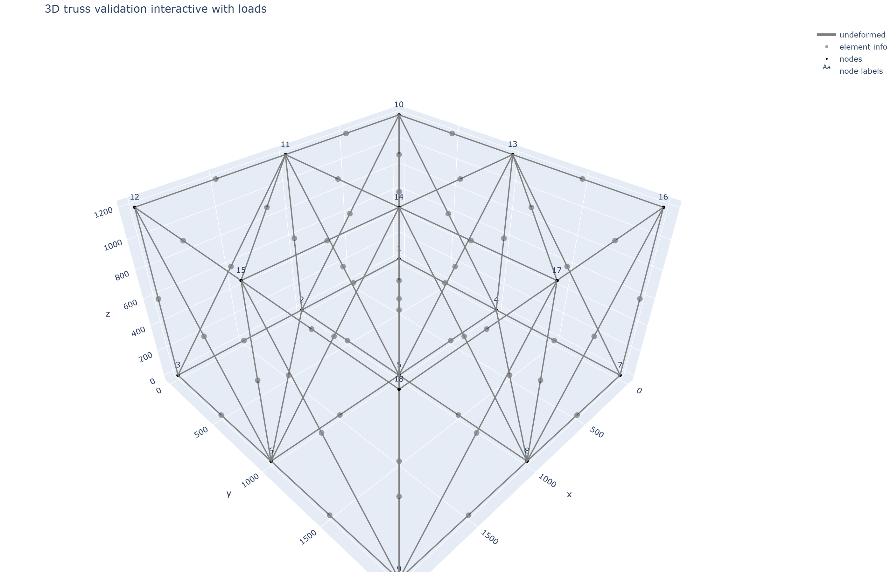
Figure X shows the space-truss validation model in undeformed and deformed form. The undeformed geometry is shown in gray and the deformed geometry is shown in red with an amplified scale factor to make the structural response visible. The figure confirms that the model behaves as a true 3D truss system and provides a clear visual check of the deformation pattern under the applied nodal loads.
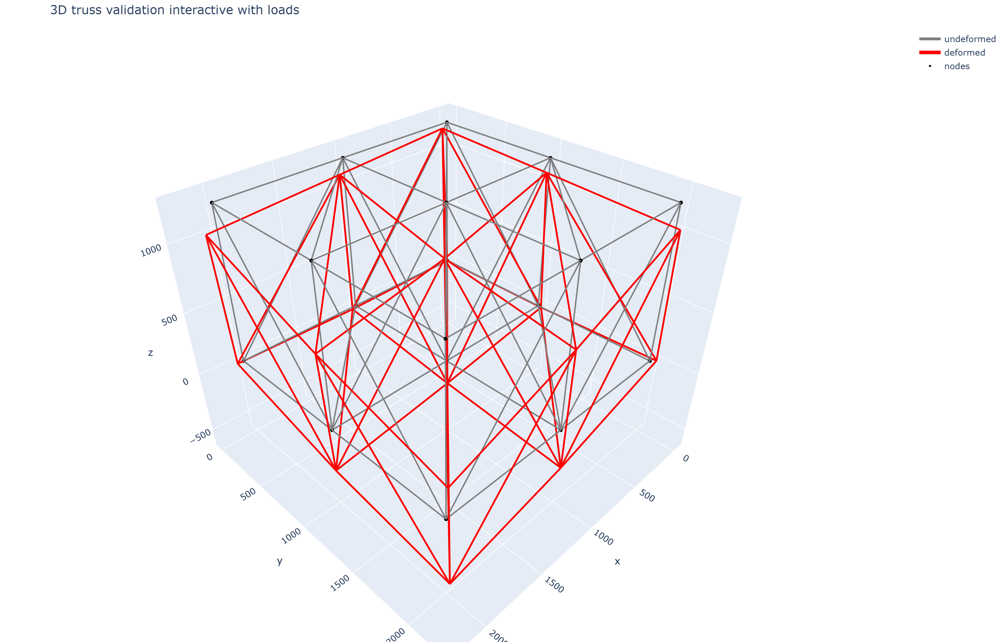
Figure X. 3D truss validation model showing undeformed and deformed geometry.

#### 8. Saved outputs

This run also generated the standard saved project outputs in the run folder for the model. The project output system writes organized result files including nodal displacements, support reactions, local and global element force tables, derived element results, a markdown summary, and machine-readable JSON summaries. This saved-output structure is useful because it allows the validation case to be reviewed later without rerunning the notebook. 

#### 9. Interpretation statement

This validation example confirms that the current project solver reproduces the expected behavior of a true 3D truss system with very good accuracy. The near-exact support reactions, the close agreement in maximum nodal displacements, and the strong agreement in selected member axial forces together indicate that the implementation is correctly handling 3D truss geometry, local-to-global transformation, stiffness assembly, support conditions, solution of the global system, and axial-force recovery.

### 3.2 3D frame validation

#### 1. Problem description

To validate the three dimensional frame implementation, a small portal-style frame example from the class notebook was recreated in the project JSON format. The example consists of two frame elements and three nodes. The first member is vertical and the second member is horizontal. The loading combines a uniform member load on the vertical member and a midpoint point load on the horizontal member. This case is a useful benchmark because it checks whether the solver can correctly handle frame stiffness assembly, member loading, local-to-global transformation, and recovery of local end forces in a compact model.

This baseline frame case is intentionally unreleased. Member release behavior is verified separately in the special-feature section.

#### 2. Input data

The validation model uses a consistent m-kN unit system. The main input data are summarized below.

- Number of nodes  
  3

- Number of elements  
  2

- Element type  
  both members are `3D_frame`

- Material properties  
  `E = 200000000.0 kN/m^2`  
  `G = 76923076.92307693 kN/m^2`

- Section properties  
  `A = 0.00474 m^2`  
  `Iy = 2.22e-05 m^4`  
  `Iz = 2.22e-05 m^4`  
  `J = 2.22e-05 m^4`

- Node coordinates  
  node 1  `(0.0, 0.0, 0.0)`  
  node 2  `(0.0, 10.0, 0.0)`  
  node 3  `(8.0, 10.0, 0.0)`

- Supports  
  node 1 fixed  
  node 3 restrained in translation with free rotation about z  
  out-of-plane DOFs restrained consistently with the 3D embedding

- Applied member loads  
  element 1  
  `uniform_local_y = -24.0 kN/m`  
  element 2  
  `point_local_y_midspan = -75.0 kN`

The preprocessed model summary reported 3 nodes, 2 elements, 4 free DOFs, and 14 restrained DOFs. The maximum displacement magnitude occurred at node 2 and was 0.001128 m.

#### 3. Benchmark solution

The class notebook provides benchmark displacements, support reactions, and local element end forces for this frame example. These are used here as the reference solution.

Key benchmark quantities are

- Node 2  
  `ux = -0.000955147309 m`  
  `uy = 0.000599487331 m`  
  `rz = -0.025390966887 rad`

- Node 3  
  `rz = -0.021200704215 rad`

- Node 1 reactions  
  `Rx = 126.81504382729 kN`  
  `Ry = -56.831398945727 kN`  
  `Mz = -222.801629838714 kN-m`

- Node 3 reactions  
  `Rx = 113.18495617271 kN`  
  `Ry = -18.168601054273 kN`

- Element 1 local end-force benchmark  
  `[-56.831398945727, -126.81504382729, 0.0, 0.0, 0.0, -222.801629838714, 56.831398945727, -113.18495617271, 0.0, 0.0, 0.0, 154.651191565815]`

- Element 2 local end-force benchmark  
  `[-113.1849561727, -56.83139894573, 0.0, 0.0, 0.0, -154.6511915658, 113.1849561727, -18.16860105427, 0.0, 0.0, 0.0, 0.0]`

#### 4. Corresponding computer-model input

The example was recreated as a project input file

`inputs/validation/Validation files from previous examples/validation_3d_frame_with_member_loads.json`

The model was embedded in the project’s mixed 3D framework by placing the frame in the global x-y plane with `z = 0`. This allowed the same project solver to analyze the frame while preserving the original 2D benchmark behavior.

#### 5. Code results

The notebook run produced the following results.

Key nodal displacements

| Node | ux m | uy m | rz rad | disp_mag m | rot_mag rad |
|---|---:|---:|---:|---:|---:|
| 2 | -0.000955 | 0.000599 | -0.025391 | 0.001128 | 0.025391 |
| 3 | 0.000000 | 0.000000 | -0.021201 | 0.000000 | 0.021201 |

Key support reactions

| Node | Rx kN | Ry kN | Rz kN | Mx kN-m | My kN-m | Mz kN-m |
|---|---:|---:|---:|---:|---:|---:|
| 1 | 126.815044 | -56.831399 | 0.0 | 0.0 | 0.0 | -222.801630 |
| 3 | 113.184956 | -18.168601 | 0.0 | 0.0 | 0.0 | 0.0 |

Local element end forces

| Element | Fx_i | Fy_i | Fz_i | Mx_i | My_i | Mz_i | Fx_j | Fy_j | Fz_j | Mx_j | My_j | Mz_j |
|---|---:|---:|---:|---:|---:|---:|---:|---:|---:|---:|---:|---:|
| 1 | -56.831399 | -126.815044 | 0.0 | 0.0 | 0.0 | -222.801630 | 56.831399 | -113.184956 | 0.0 | 0.0 | 0.0 | 154.651192 |
| 2 | -113.184956 | -56.831399 | 0.0 | 0.0 | 0.0 | -154.651192 | 113.184956 | -18.168601 | 0.0 | 0.0 | 0.0 | 0.000000 |

#### 6. Comparison between benchmark and code output

The displacement and reaction comparisons show essentially exact agreement.

| Quantity | Benchmark | Code | Difference | Percent difference |
|---|---:|---:|---:|---:|
| Node 2 ux | -0.000955147309 | -0.000955147309 | -4.743466e-13 | 4.966214e-08 |
| Node 2 uy | 0.000599487331 | 0.000599487331 | -3.488723e-13 | -5.819511e-08 |
| Node 2 rz | -0.025390966887 | -0.025390966887 | 2.090030e-13 | -8.231390e-10 |
| Node 3 rz | -0.021200704215 | -0.021200704215 | 1.146305e-13 | -5.406921e-10 |
| Node 1 Rx | 126.81504382729 | 126.81504382729 | -8.526513e-14 | -6.723582e-14 |
| Node 1 Ry | -56.831398945727 | -56.831398945727 | 9.947598e-14 | -1.750370e-13 |
| Node 1 Mz | -222.801629838714 | -222.801629838714 | -3.694822e-13 | 1.658346e-13 |
| Node 3 Rx | 113.18495617271 | 113.18495617271 | 7.105427e-14 | 6.277714e-14 |
| Node 3 Ry | -18.168601054273 | -18.168601054273 | -9.592327e-14 | 5.279618e-13 |

The local element end forces also matched the benchmark values to numerical precision.

#### 7. Plot

Figure X shows the baseline 3D frame validation model in undeformed and deformed form. The undeformed geometry is shown in gray and the deformed geometry is shown in red. The updated plotting helper now displays the deformed frame centerline with curvature, so the bending shape is visible rather than being shown only as a straight chord between end nodes.

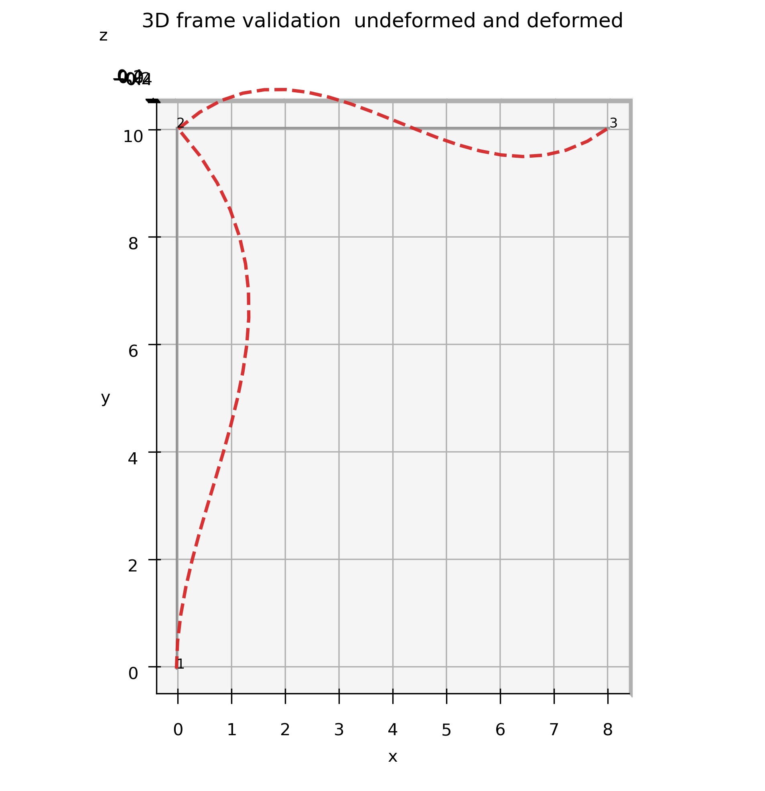

If you want to also show the interactive-style figure in markdown, use

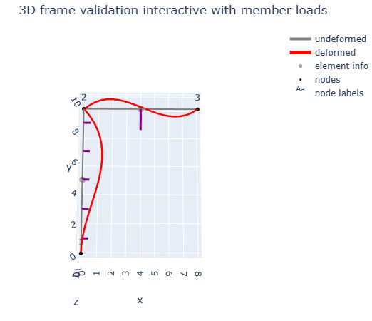


#### 8. Saved outputs

This run generated the standard saved project outputs in the run folder for the model. The saved output package includes nodal displacement tables, support reaction tables, local and global element force tables, derived response tables, and summary files. This organized output structure is useful because it allows the validation case to be reviewed later without rerunning the notebook.

Typical saved files for this case include

- `summary.md`
- `global_summary.json`
- `node_displacements.csv`
- `support_reactions.csv`
- `element_local_end_forces.csv`
- `element_global_end_forces.csv`
- `element_derived_results.csv`


#### 9. Interpretation statement

This validation example confirms that the current project solver reproduces the expected response of a small 3D frame benchmark with very high accuracy. The essentially exact agreement in nodal displacements, support reactions, and local element end forces indicates that the implementation is correctly handling 3D frame stiffness assembly, local-to-global transformation, member loading, system solution, and frame-force recovery.

### 3.3.1 Moment release verification

#### 1. Problem description

To verify member release behavior, a small frame example with a hinge at the beam-column joint was recreated from the class notebook. The model consists of a vertical column connected to a horizontal beam. The goal of this case is to confirm that the released joint does not transfer bending moment while the rest of the frame still carries the expected axial force, shear force, and support reactions.

This case is based on the class hinge example, but the project implementation reproduces the hinge behavior using released frame ends in the element input together with a stabilizing restrained rotational DOF at node 2. The release implementation in the project code is an element-level released-end formulation using static condensation, rather than lecture Method A or Method B. 

#### 2. Input data

The validation model uses a consistent m-kN unit system. The main input data are listed below.

- number of nodes, 3
- number of elements, 2
- element type, both members are `3D_frame`
- material properties  
  `E = 200000000.0 kN/m^2`  
  `G = 76923076.92307693 kN/m^2`
- section properties  
  `A = 0.00474 m^2`  
  `Iy = 2.22e-05 m^4`  
  `Iz = 2.22e-05 m^4`  
  `J = 2.22e-05 m^4`

Node coordinates

- node 1, `(0.0, 0.0, 0.0)`
- node 2, `(0.0, 10.0, 0.0)`
- node 3, `(8.0, 10.0, 0.0)`

Supports

- node 1 fixed
- node 3 restrained in translation with free in-plane rotation
- node 2 `rz` restrained as the stabilizing rotational DOF for the released-joint verification case

Member loads

- element 1, `uniform_local_y = -24.0 kN/m`
- element 2, `point_local_y_midspan = -75.0 kN`

Release definitions

- element 1, end release at node 2
- element 2, start release at node 2

#### 3. Benchmark solution

The class notebook provides the expected frame response for the released-joint case. The main benchmark quantities used for comparison are the support reactions, the approximate nodal displacements, and the local member end-force pattern.

Key benchmark values are

- node 1 reactions  
  `Rx = 150.010 kN`  
  `Ry = -37.500 kN`  
  `Mz = -300.101 kN-m`

- node 3 reactions  
  `Rx = 89.990 kN`  
  `Ry = -37.500 kN`

- node 2 displacement, approximately  
  `ux ≈ -0.001 m`  
  `uy ≈ 0.001 m`

- node 3 rotation, approximately  
  `rz ≈ -0.068 rad`

- released-end local moments should be zero

#### 4. Corresponding computer-model input

The case was recreated as

`inputs/validation/Validation files from previous examples/verification_moment_release_frame.json`

The frame was placed in the global x-y plane with `z = 0`, so the same mixed 3D solver could be used while preserving the original planar benchmark behavior.

#### 5. Code results

The notebook run produced the following key results.

Model summary

- model name, `verification_moment_release_frame`
- nodes, 3
- elements, 2
- free DOFs, 3
- restrained DOFs, 15
- maximum displacement node, 2
- maximum displacement magnitude, `0.000856 m`

Key nodal displacements

| Node | ux m | uy m | rz rad | disp_mag m | rot_mag rad |
|---|---:|---:|---:|---:|---:|
| 2 | -0.000759 | 0.000396 | 0.000000 | 0.000856 | 0.000000 |
| 3 | 0.000000 | 0.000000 | -0.067617 | 0.000000 | 0.067617 |

Key support reactions

| Node | Rx kN | Ry kN | Rz kN | Mx kN-m | My kN-m | Mz kN-m |
|---|---:|---:|---:|---:|---:|---:|
| 1 | 150.010115 | -37.500000 | 0.0 | 0.0 | 0.0 | -300.101153 |
| 3 | 89.989885 | -37.500000 | 0.0 | 0.0 | 0.0 | 0.000000 |

Local element end forces

| Element | Fx_i | Fy_i | Mz_i | Fx_j | Fy_j | Mz_j |
|---|---:|---:|---:|---:|---:|---:|
| 1 | -37.500000 | -150.010115 | -300.101153 | 37.500000 | -89.989885 | 0.000000 |
| 2 | -89.989885 | -37.500000 | 0.000000 | 89.989885 | -37.500000 | 0.000000 |

The released-end moments are exactly zero in the project output.

#### 6. Comparison between benchmark and code output

The reaction comparison shows essentially exact agreement.

| Quantity | Benchmark | Code | Difference | Percent difference |
|---|---:|---:|---:|---:|
| Node 1 Rx | 150.010 | 150.010115 | 0.000115 | 0.000077 |
| Node 1 Ry | -37.500 | -37.500000 | 0.000000 | 0.000000 |
| Node 1 Mz | -300.101 | -300.101153 | -0.000153 | 0.000051 |
| Node 3 Rx | 89.990 | 89.989885 | -0.000115 | -0.000128 |
| Node 3 Ry | -37.500 | -37.500000 | 0.000000 | 0.000000 |

The displacement comparison is also reasonable, but it should be interpreted carefully because the benchmark displacement values in the notebook were only reported approximately to three decimal places.

| Quantity | Approx. benchmark | Code | Difference |
|---|---:|---:|---:|
| Node 2 ux | -0.001 | -0.000759 | 0.000241 |
| Node 2 uy | 0.001 | 0.000396 | -0.000604 |
| Node 3 rz | -0.068 | -0.067617 | 0.000383 |

The most important verification result is the released-end moment check.

| Released moment quantity | Expected | Code |
|---|---:|---:|
| Element 1, `Mz_j_local` | 0.0 | 0.0 |
| Element 2, `Mz_i_local` | 0.0 | 0.0 |

This confirms that the joint hinge is functioning correctly in the project model.

#### 7. Plot

Figure X shows the released-joint frame in undeformed and deformed form. The undeformed geometry is shown in gray and the deformed geometry is shown in red. The deformed shape displays a clear change in slope at node 2, which is consistent with hinge behavior. The updated plotting helper also shows curved frame deformation rather than a straight chord between end nodes.

The moment release

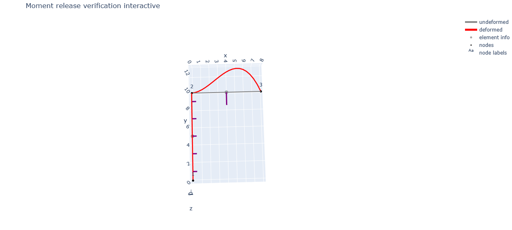


#### 8. Saved outputs

This run generated the standard saved project outputs in the model run folder, including nodal displacement tables, support reaction tables, local and global element force tables, derived element results, and summary files. The output-writing path is part of the current project framework, so this verification case can be reviewed later without rerunning the notebook.

Typical saved files for this case include

- `summary.md`
- `global_summary.json`
- `node_displacements.csv`
- `support_reactions.csv`
- `element_local_end_forces.csv`
- `element_global_end_forces.csv`
- `element_derived_results.csv`

#### 9. Interpretation statement

This verification case confirms that the current project implementation reproduces the expected behavior of a frame with a released beam-column joint. The support reactions match the benchmark essentially exactly, the deformed shape is qualitatively consistent with a hinge at node 2, and the released-end local moments are exactly zero in the project output. Together, these results show that the member release implementation is functioning correctly for this validation case.

### 3.3.2 Uniform temperature verification

#### 1. Problem description

To verify uniform temperature loading, the same small frame used in the earlier frame benchmark was analyzed with uniform temperature changes applied to both members. This case was chosen because the final project requires uniform temperature loading, and the modified notebook solution provides a direct benchmark for comparison. The frame consists of one vertical member and one horizontal member, and the original mechanical member loads were kept so that the thermal effects could be checked within a combined mechanical and thermal response case.

#### 2. Input data

The model uses a consistent m-kN unit system. The geometry, supports, and mechanical loads are the same as the baseline frame case.

Node coordinates

- node 1  `(0.0, 0.0, 0.0)`
- node 2  `(0.0, 10.0, 0.0)`
- node 3  `(8.0, 10.0, 0.0)`

Material and section properties

- `E = 200000000.0 kN/m^2`
- `G = 76923076.92307693 kN/m^2`
- `alpha = 0.000012 1/C`
- `A = 0.00474 m^2`
- `Iy = 2.22e-05 m^4`
- `Iz = 2.22e-05 m^4`
- `J = 2.22e-05 m^4`

Mechanical member loads

- element 1  `uniform_local_y = -24.0 kN/m`
- element 2  `point_local_y_midspan = -75.0 kN`

Uniform temperature loads

- element 1  `deltaT = 10.0 C`
- element 2  `deltaT = 5.0 C`

Supports

- node 1 fixed
- node 3 restrained in translation with free in-plane rotation
- out-of-plane DOFs restrained consistently with the 3D embedding

#### 3. Benchmark solution

The benchmark was taken from the modified notebook case in which both members were assigned uniform temperature changes. The main benchmark quantities used for comparison were the nodal displacements at nodes 2 and 3, the support reactions at nodes 1 and 3, and the local element end-force results for both members.

Benchmark displacement values from the notebook were

- node 2  `ux = 0.00047544 m`
- node 2  `uy = 0.00060026 m`
- node 2  `rz = 0.02535554 rad`
- node 3  `rz = 0.02099346 rad`

Benchmark support reactions were

- node 1  `Rx = -126.780047 kN`
- node 1  `Ry = 56.855238 kN`
- node 1  `Mz = 222.642377 kN-m`
- node 3  `Rx = -113.219953 kN`
- node 3  `Ry = 18.144762 kN`

Benchmark local element end forces were

Element 1

- `N_i = 56.855238`
- `V_i = 126.780047`
- `M_i = 222.642377`
- `N_j = -56.855238`
- `V_j = 113.219953`
- `M_j = -154.841903`

Element 2

- `N_i = 113.219953`
- `V_i = 56.855238`
- `M_i = 154.841903`
- `N_j = -113.219953`
- `V_j = 18.144762`
- `M_j = 0.000000`

#### 4. Corresponding computer-model input

The case was recreated as

`inputs/validation/Validation files from previous examples/verification_uniform_temperature_frame.json`

The frame was placed in the global x-y plane with `z = 0`, so the same mixed 3D solver could be used while preserving the original planar benchmark behavior. The model uses the current project temperature input format based on element-wise `deltaT`, which is fully aligned with the final project scope.

#### 5. Code results

The project run produced the following key nodal results.

| Node | ux m | uy m | rz rad | disp_mag m | rot_mag rad |
|---|---:|---:|---:|---:|---:|
| 2 | 0.00047544 | 0.00060026 | 0.02535554 | 0.00076571 | 0.02535554 |
| 3 | 0.00000000 | 0.00000000 | 0.02099346 | 0.00000000 | 0.02099346 |

The support reactions were

| Node | Rx kN | Ry kN | Mz kN-m |
|---|---:|---:|---:|
| 1 | -126.780047 | 56.855238 | 222.642377 |
| 3 | -113.219953 | 18.144762 | 0.000000 |

The local element end-force results were

| Element | Fx_i | Fy_i | Mz_i | Fx_j | Fy_j | Mz_j |
|---|---:|---:|---:|---:|---:|---:|
| 1 | 56.855238 | 126.780047 | 222.642377 | -56.855238 | 113.219953 | -154.841903 |
| 2 | 113.219953 | 56.855238 | 154.841903 | -113.219953 | 18.144762 | 0.000000 |

#### 6. Comparison between benchmark and code output

The comparison shows essentially exact agreement between the project code and the notebook benchmark.

| Quantity | Benchmark | Code | Difference |
|---|---:|---:|---:|
| Node 2 ux | 0.00047544 | 0.00047544 | about 0 |
| Node 2 uy | 0.00060026 | 0.00060026 | about 0 |
| Node 2 rz | 0.02535554 | 0.02535554 | about 0 |
| Node 3 rz | 0.02099346 | 0.02099346 | about 0 |
| Node 1 Rx | -126.780047 | -126.780047 | about 0 |
| Node 1 Ry | 56.855238 | 56.855238 | about 0 |
| Node 1 Mz | 222.642377 | 222.642377 | about 0 |
| Node 3 Rx | -113.219953 | -113.219953 | about 0 |
| Node 3 Ry | 18.144762 | 18.144762 | about 0 |

The local element end-force results also match the benchmark values. After correcting the project temperature fixed-end-force sign, the thermal contribution assembled by the project matched the notebook thermal extra vector exactly, confirming that the uniform temperature implementation is now consistent with the benchmark solution.

#### 7. Plot

Figure X shows the uniform temperature verification case in undeformed and deformed form. The undeformed geometry is shown in gray and the deformed geometry is shown in red. The deformed shape differs from the baseline mechanical case because the members now experience restrained thermal expansion in addition to the mechanical loads.

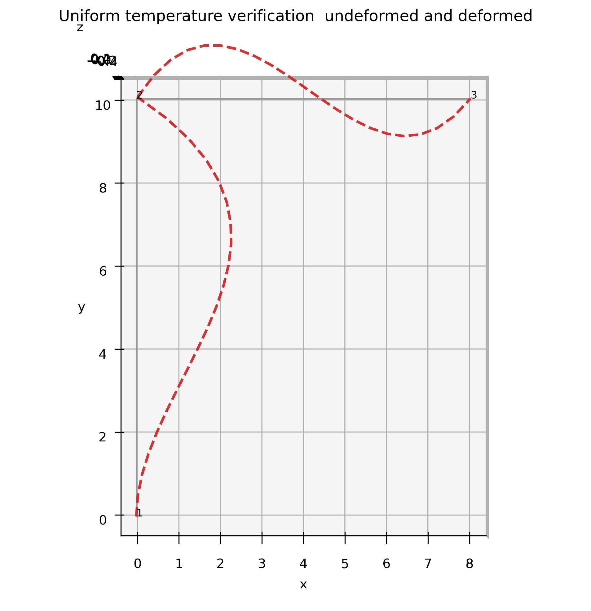

If you also want the interactive-style figure in markdown, use

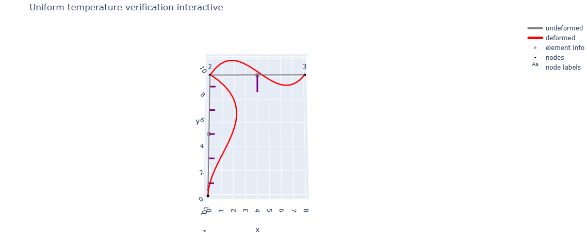

#### 8. Saved outputs

This run generated the standard saved output package for the model, including nodal displacement tables, support reaction tables, local and global element force tables, derived response tables, and summary files. The organized saved-output structure makes it easy to review the temperature case later without rerunning the notebook.

Typical saved files for this case include

- `summary.md`
- `global_summary.json`
- `node_displacements.csv`
- `support_reactions.csv`
- `element_local_end_forces.csv`
- `element_global_end_forces.csv`
- `element_derived_results.csv`

#### 9. Interpretation statement

This case confirms that the project implementation of uniform temperature loading is working correctly. The nodal displacements, support reactions, and local element end forces all match the benchmark notebook solution, and the assembled thermal fixed-end contribution was confirmed to be identical to the notebook thermal extra vector after the project sign correction. Together, these results show that the project solver is correctly incorporating uniform thermal strain effects through the element fixed-end-force formulation.
### 3.3.3 Support settlement verification

#### 1. Problem description

This verification case checks whether the code correctly handles prescribed support displacements in a frame model. The same small frame used in the earlier frame benchmark was analyzed, but three prescribed support motions were added. The case includes the original mechanical member loads together with imposed support settlement and rotation. This example is important because the final project requires the code to handle prescribed support displacements as part of the general direct stiffness workflow.

#### 2. Input data

The model uses a consistent m-kN unit system. The frame geometry and mechanical loading are the same as the baseline frame case.

Node coordinates

- node 1 `(0.0, 0.0, 0.0)`
- node 2 `(0.0, 10.0, 0.0)`
- node 3 `(8.0, 10.0, 0.0)`

Material and section properties

- `E = 200000000.0 kN/m^2`
- `G = 76923076.92307693 kN/m^2`
- `A = 0.00474 m^2`
- `Iy = 2.22e-05 m^4`
- `Iz = 2.22e-05 m^4`
- `J = 2.22e-05 m^4`

Mechanical member loads

- element 1 `uniform_local_y = -24.0 kN/m`
- element 2 `point_local_y_midspan = -75.0 kN`

Prescribed support motions

- node 1 `rz = 0.01 rad`
- node 3 `ux = 0.005 m`
- node 3 `uy = -0.01 m`

Supports

- node 1 fixed
- node 3 restrained in translation with free in-plane rotation
- out-of-plane DOFs restrained consistently with the 3D embedding

#### 3. Benchmark solution

The benchmark values were taken from the verified notebook solution for the support-settlement example.

Benchmark displacements

- node 2 `ux = 0.00593846 m`
- node 2 `uy = -0.00059439 m`
- node 2 `rz = 0.02181937 rad`
- node 3 `rz = 0.02111055 rad`

Benchmark reactions

- node 1 `Rx = -128.793081 kN`
- node 1 `Ry = 56.348349 kN`
- node 1 `Mz = 238.717605 kN-m`
- node 3 `Rx = -111.206919 kN`
- node 3 `Ry = 18.651651 kN`

Benchmark local element end forces

Element 1

- `N_i = 56.348349`
- `V_i = 128.793081`
- `M_i = 238.717605`
- `N_j = -56.348349`
- `V_j = 111.206919`
- `M_j = -150.786794`

Element 2

- `N_i = 111.206919`
- `V_i = 56.348349`
- `M_i = 150.786794`
- `N_j = -111.206919`
- `V_j = 18.651651`
- `M_j = 0.000000`

#### 4. Corresponding computer model input

The case was recreated in the project as

`inputs/validation/Validation files from previous examples/verification_support_settlement_frame.json`

The frame was placed in the global x-y plane with `z = 0`, so the mixed 3D solver could be used while preserving the original planar benchmark behavior. The imposed support motions were entered through the `prescribed_displacements` block in the JSON input file, which matches the final project requirement for prescribed support displacements. 

#### 5. Code results

The project run produced the following key nodal results.

| Node | ux m | uy m | rz rad | disp_mag m | rot_mag rad |
|---|---|---|---|---|---|
| 2 | 0.005938 | -0.000594 | 0.021819 | 0.005968 | 0.021819 |
| 3 | 0.005000 | -0.010000 | 0.021111 | 0.011180 | 0.021111 |

The support reactions were

| Node | Rx kN | Ry kN | Mz kN-m |
|---|---|---|---|
| 1 | -128.793081 | 56.348349 | 238.717605 |
| 3 | -111.206919 | 18.651651 | 0.000000 |

The local element end-force results were

| Element | Fx_i | Fy_i | Mz_i | Fx_j | Fy_j | Mz_j |
|---|---|---|---|---|---|---|
| 1 | 56.348349 | 128.793081 | 238.717605 | -56.348349 | 111.206919 | -150.786794 |
| 2 | 111.206919 | 56.348349 | 150.786794 | -111.206919 | 18.651651 | 0.000000 |

#### 6. Comparison between benchmark and code output

The comparison shows essentially exact agreement between the code and the benchmark notebook values.

| Quantity | Benchmark | Code | Difference |
|---|---|---|---|
| Node 2 ux | 0.00593846 | 0.005938 | about 0 |
| Node 2 uy | -0.00059439 | -0.000594 | about 0 |
| Node 2 rz | 0.02181937 | 0.021819 | about 0 |
| Node 3 rz | 0.02111055 | 0.021111 | about 0 |
| Node 1 Rx | -128.793081 | -128.793081 | about 0 |
| Node 1 Ry | 56.348349 | 56.348349 | about 0 |
| Node 1 Mz | 238.717605 | 238.717605 | about 0 |
| Node 3 Rx | -111.206919 | -111.206919 | about 0 |
| Node 3 Ry | 18.651651 | 18.651651 | about 0 |

The local element end-force values also matched the benchmark pattern for both members, including the zero end moment at node 3 for element 2.

#### 7. Plot

Figure X shows the support-settlement verification case in undeformed and deformed form. The undeformed geometry is shown in gray and the deformed geometry is shown in red. The deformed shape reflects both the imposed support motion and the mechanical loading.


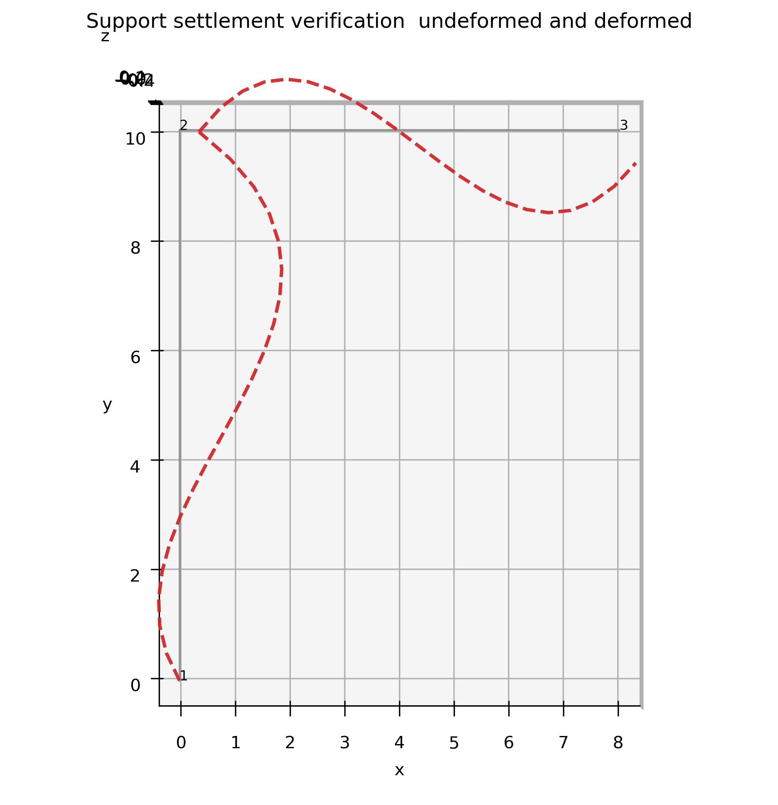
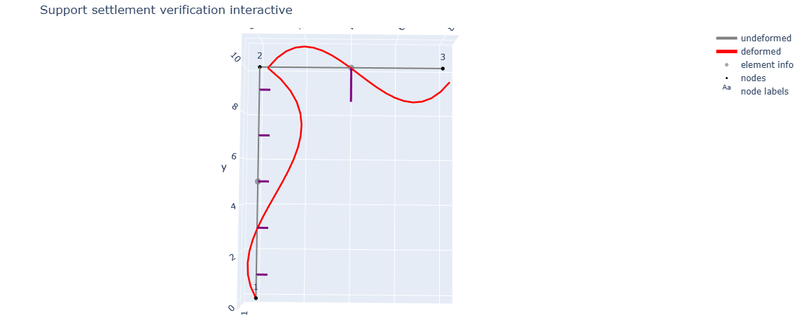
#### 8. Saved outputs

This run generated the standard saved output package for the model, including the nodal displacement table, support reaction table, element local end-force table, element global end-force table, derived element results table, summary files, and run log. The code writes these files to the organized run folder structure inside `outputs/runs/<model_name>/`.

Typical saved files include

- `summary.md`
- `global_summary.json`
- `dof_summary.json`
- `node_displacements.csv`
- `support_reactions.csv`
- `element_local_end_forces.csv`
- `element_global_end_forces.csv`
- `element_derived_results.csv`
- `run_log.txt`

#### 9. Interpretation statement

This case confirms that the project implementation of prescribed support displacement is working correctly. The nodal displacements, support reactions, and local element end forces all match the benchmark solution very closely. These results show that the code correctly incorporates imposed support motion into the partitioned direct stiffness solution and into the final element force recovery.

### 3.3.4 Fabrication error verification

#### 1. Problem description

This verification case checks whether the code correctly handles fabrication or fit-up errors in frame members. The same small frame used in the earlier validation examples was analyzed, but both members were assumed to be fabricated 3 mm too short. The original mechanical member loads were kept, so the response includes both the mechanical effects and the additional fixed-end actions caused by the fabrication errors. This case is important because the final project requires the code to handle fabrication length errors through the right-hand side of the direct stiffness equations.

#### 2. Input data

The model uses a consistent m-kN unit system. The frame geometry, supports, and mechanical loading are the same as the baseline frame case.

Node coordinates

- node 1 `(0.0, 0.0, 0.0)`
- node 2 `(0.0, 10.0, 0.0)`
- node 3 `(8.0, 10.0, 0.0)`

Material and section properties

- `E = 200000000.0 kN/m^2`
- `G = 76923076.92307693 kN/m^2`
- `A = 0.00474 m^2`
- `Iy = 2.22e-05 m^4`
- `Iz = 2.22e-05 m^4`
- `J = 2.22e-05 m^4`

Mechanical member loads

- element 1 `uniform_local_y = -24.0 kN/m`
- element 2 `point_local_y_midspan = -75.0 kN`

Fabrication errors

- element 1 `deltaL = -0.003 m`
- element 2 `deltaL = -0.003 m`

Supports

- node 1 fixed
- node 3 restrained in translation with free in-plane rotation
- out-of-plane DOFs restrained consistently with the 3D embedding

#### 3. Benchmark solution

The benchmark values were taken from the verified A10 fabrication-error notebook solution.

Benchmark displacements

- node 2 `ux = 0.00395391 m`
- node 2 `uy = -0.00359855 m`
- node 2 `rz = 0.02534020 rad`
- node 3 `rz = 0.02178841 rad`

Benchmark reactions

- node 1 `Rx = -126.961294 kN`
- node 1 `Ry = 56.742810 kN`
- node 1 `Mz = 223.555420 kN-m`
- node 3 `Rx = -113.038706 kN`
- node 3 `Ry = 18.257190 kN`

Benchmark local element end forces

Element 1

- `N_i = 56.742810`
- `V_i = 126.961294`
- `M_i = 223.555420`
- `N_j = -56.742810`
- `V_j = 113.038706`
- `M_j = -153.942483`

Element 2

- `N_i = 113.038706`
- `V_i = 56.742810`
- `M_i = 153.942483`
- `N_j = -113.038706`
- `V_j = 18.257190`
- `M_j = 0.000000`

#### 4. Corresponding computer model input

The case was recreated in the project as

`inputs/validation/Validation files from previous examples/verification_fabrication_error_frame.json`

The frame was placed in the global x-y plane with `z = 0`, so the mixed 3D solver could be used while preserving the original planar benchmark behavior. The fabrication errors were entered through the `fabrication_errors` block in the JSON input file, using `deltaL = -0.003` for both members.

#### 5. Code results

The project run produced the following key nodal results.

| Node | ux m | uy m | rz rad | disp_mag m | rot_mag rad |
|---|---:|---:|---:|---:|---:|
| 2 | 0.003954 | -0.003599 | 0.025340 | 0.005346 | 0.025340 |
| 3 | 0.000000 | 0.000000 | 0.021788 | 0.000000 | 0.021788 |

The support reactions were

| Node | Rx kN | Ry kN | Mz kN-m |
|---|---:|---:|---:|
| 1 | -126.961294 | 56.742810 | 223.555420 |
| 3 | -113.038706 | 18.257190 | 0.000000 |

The local element end-force results were

| Element | Fx_i | Fy_i | Mz_i | Fx_j | Fy_j | Mz_j |
|---|---:|---:|---:|---:|---:|---:|
| 1 | 56.742810 | 126.961294 | 223.555420 | -56.742810 | 113.038706 | -153.942483 |
| 2 | 113.038706 | 56.742810 | 153.942483 | -113.038706 | 18.257190 | 0.000000 |

#### 6. Comparison between benchmark and code output

The comparison shows essentially exact agreement between the code and the benchmark.

| Quantity | Benchmark | Code | Difference |
|---|---:|---:|---:|
| Node 2 ux | 0.00395391 | 0.003954 | about 0 |
| Node 2 uy | -0.00359855 | -0.003599 | about 0 |
| Node 2 rz | 0.02534020 | 0.025340 | about 0 |
| Node 3 rz | 0.02178841 | 0.021788 | about 0 |
| Node 1 Rx | -126.961294 | -126.961294 | about 0 |
| Node 1 Ry | 56.742810 | 56.742810 | about 0 |
| Node 1 Mz | 223.555420 | 223.555420 | about 0 |
| Node 3 Rx | -113.038706 | -113.038706 | about 0 |
| Node 3 Ry | 18.257190 | 18.257190 | about 0 |

The local element end-force values also match the benchmark pattern for both members, including the zero end moment at node 3 for element 2.

#### 7. Plot

Figure X shows the fabrication-error verification case in undeformed and deformed form. The undeformed geometry is shown in gray and the deformed geometry is shown in red. The deformed shape reflects both the mechanical loading and the internal fit-up forces caused by the shortened members.

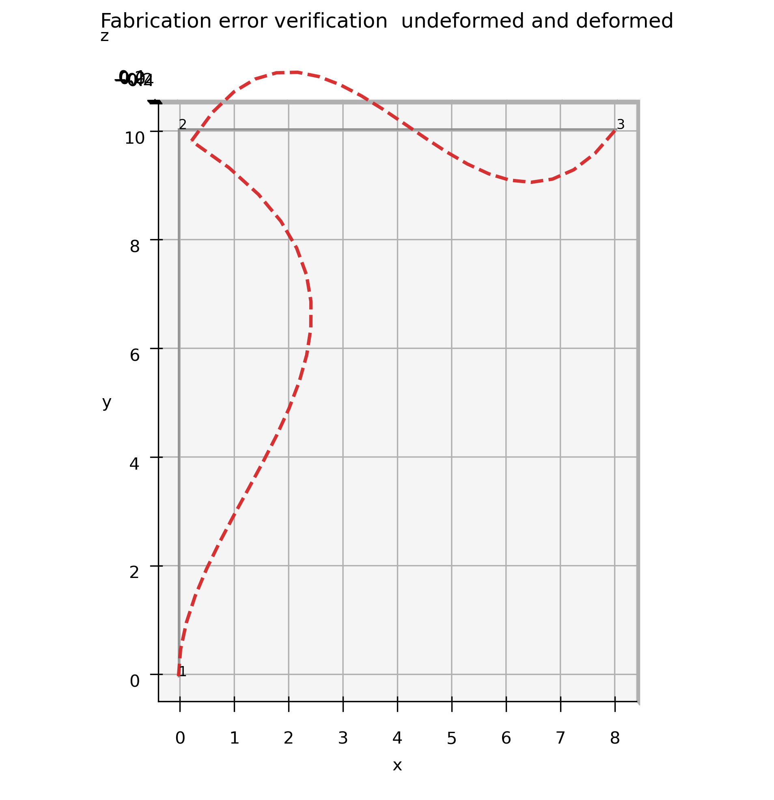

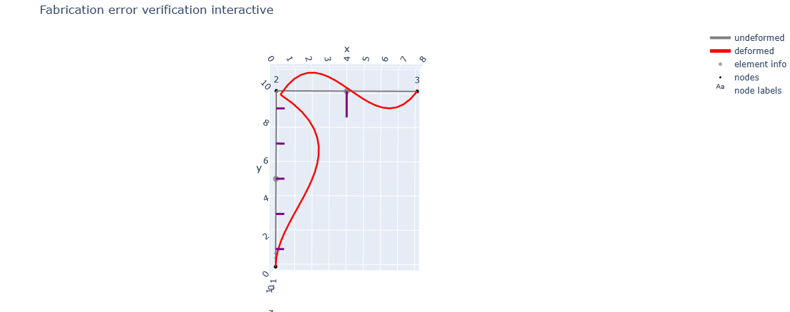

#### 8. Saved outputs

This run generated the standard saved output package for the model, including the nodal displacement table, support reaction table, element local end-force table, element global end-force table, derived element results table, summary files, and run log.

Typical saved files include

- `summary.md`
- `global_summary.json`
- `dof_summary.json`
- `node_displacements.csv`
- `support_reactions.csv`
- `element_local_end_forces.csv`
- `element_global_end_forces.csv`
- `element_derived_results.csv`
- `run_log.txt`

#### 9. Interpretation statement

This case confirms that the project implementation of fabrication or fit-up error is working correctly. The nodal displacements, support reactions, and local element end forces all match the benchmark solution very closely. These results show that the code correctly incorporates fabrication length errors through the fixed-end-force formulation and recovers the correct structural response.
## 4. Final Complex Structure Study

### 4.1 Introduction to the Fort Griffin Bridge

The final complex structure study focuses on the main span of the Fort Griffin Iron Truss Bridge in Shackelford County, Texas. The bridge was originally constructed in 1885 by the King Iron and Bridge Manufacturing Company. It is historically important because it is one of the oldest surviving truss bridges in Texas and the last remaining pin connected Pratt through truss in Shackelford County.

The bridge is well suited to this project because the main span can be idealized as a mixed structural system. The side trusses primarily carry axial force and are therefore represented with 3D truss elements, while the transverse floor beams and longitudinal stringers introduce bending behavior and are represented with 3D frame elements. The Fort Griffin bridge therefore provides a strong final application for a mixed 3D truss and frame solver rather than a purely truss based analysis.

Only the main span is modeled in this project. This is a deliberate scope decision. The main span already captures the most important mixed behavior needed for the final project, while excluding the approach spans avoids additional uncertainty related to bent behavior, connection idealization, and support assumptions.


*Figure 4.1. Barrel view from east of the Fort Griffin Iron Truss Bridge.*


*Figure 4.2. Elevation from south of the Fort Griffin Iron Truss Bridge.*


*Figure 4.3. Underside of the main span from east of the Fort Griffin Iron Truss Bridge.*

### 4.2 Background Research and Literature Review

The main source for the bridge study is the case study report on the evaluation and rehabilitation of the historic metal truss bridge in Shackelford County, Texas. That study includes data collection, material evaluation, structural analysis and load rating, field load testing, and rehabilitation options. It also provides bridge history, floor system details, truss geometry, support information, photographs, and drawings.

The case study and the preliminary plan describe the bridge as a wrought iron pin connected Pratt through truss. The main span is about 109 to 110 ft long, the overall width is about 20 ft, the clear roadway width is about 13 ft 6 in, and the truss height is about 18 ft. These dimensions establish the overall scale and proportions of the structural system used for the analytical model.

The literature also provides useful information about the member types and the floor system. The bottom chord is formed from eyebars, the top chord is a built up compression member, the bridge has vertical and diagonal truss members, and the floor system consists of timber deck planks supported by longitudinal timber stringers and transverse metal floor beams. The bridge also includes lateral bracing systems, which confirms that the real structure is more complex than the simplified analytical model used in this project.

The available case-study documentation makes this bridge feasible for a final modeling study. The report provides more than photographs. It includes floor system details, truss geometry, support descriptions, member property tables, analysis discussion, field test information, and appendices with drawings. This allows the bridge to be modeled in a rational way while still acknowledging the need for simplifying assumptions.

### 4.3 Structural Configuration and Load Path

The structural system of the main span consists of two side trusses connected by transverse floor beams and supporting longitudinal timber stringers. The timber deck planks rest on the stringers, and the stringers rest on the floor beams. The floor beams then transfer load into the two side trusses.

The primary main-span load carrying elements are the two side trusses. Because the bridge is a Pratt through truss, vertical gravity load is expected to move from the deck system into the lower chord joints and then redistribute through the verticals, diagonals, top chord, and bottom chord according to the truss geometry.

In the mixed analytical idealization used here, the floor system acts as the first load receiving subsystem, while the two side truss planes act as the main span carrying subsystem. This is the basic load path that the revised bridge model is intended to capture.

### 4.4 Modeling Assumptions and Idealization

The Fort Griffin bridge was translated into an analytical model as a rational first idealization rather than a full historical reconstruction. The model includes only the main span because that part already captures the mixed behavior required for the project through the interaction of the two side trusses, the transverse floor beams, the longitudinal stringers, and the added top lateral bracing system. The approach spans, railings, and many secondary details were omitted so that the study could stay focused on the main mixed truss and frame system.

#### 4.4.1 Overall idealization

The bridge was modeled as two parallel side truss planes connected by a floor system. In the revised baseline bridge model, the left truss plane is placed at `y = 0.0 ft` and the right truss plane is placed at `y = 20.0 ft`. The current revised baseline contains 39 nodes. The element layout includes side-truss members, floor beams, stringers, and a first-pass top lateral bracing system.

#### 4.4.2 Where truss elements were used

The main side trusses were modeled primarily with 3D truss elements. This includes the lower chord, upper chord, vertical members, diagonal members, end members, and tension rod type members in the two side truss planes. A first-pass top lateral bracing system was also added using 3D truss elements between the top nodes of the two side trusses.

#### 4.4.3 Where frame elements were used

The floor system was modeled with 3D frame elements. The transverse floor beams were represented as frame members connecting the two side trusses at the panel locations, and the longitudinal stringers were also represented as frame members so that bending stiffness could be included in the deck support system.

#### 4.4.4 Geometric simplifications

The real bridge floor system contains more longitudinal stringers than the analytical model. The current analytical model simplifies the floor system to three longitudinal stringer lines. The two outer modeled stringer lines represent the stronger stringer regions, while the center modeled stringer line represents the lighter central stringer region.

The deck planks and thin steel floor plates were not modeled explicitly. Their effect was represented through simplified distributed loads applied to the modeled stringer lines.

#### 4.4.5 Material and section assumptions

The current baseline model uses a single wrought iron material for the bridge members, with `E = 4,176,000 kip/ft^2`, `G = 1,612,800 kip/ft^2`, and `alpha = 6.5 × 10^-6 /°F`.

Several section properties remain first-pass engineering assumptions rather than exact historical reconstructions. The truss member families currently use simplified axial areas, while the floor-beam and stringer members use assumed frame properties intended to provide a rational first approximation of stiffness. The two outer modeled stringer lines were assigned the heavier stringer section, and the center modeled stringer line was assigned the lighter section.

#### 4.4.6 Support and boundary assumptions

The support conditions in the analytical model are simplified compared with the real bridge. The baseline retains the same overall support philosophy used in the earlier bridge model. One span end restrains longitudinal movement while the opposite end allows longitudinal movement along the bridge length. Additional lateral and rotational restraints remain at many truss-plane nodes as stabilizing assumptions within the simplified three dimensional idealization.

The support system should therefore be understood as a mixed physical and numerical idealization. The longitudinal support behavior follows the intended hinge and roller concept at a basic level, while the broader lateral and rotational restraints provide stability in the current simplified model.

### 4.5 Baseline Model Input File

The  baseline model used for the final structure study is stored in the JSON file `fort_griffin_main_span_revised_baseline.json`. This file defines the bridge geometry, material properties, section properties, element types, support conditions, and applied loads in a single structured input file.
### 4.6 Initial Baseline Setup

#### 4.6.1 Baseline Loading

The  baseline uses redistributed dead-load type member loads on the three modeled stringer lines. The two outer stringer lines carry larger uniform loads, while the center stringer line carries a smaller uniform load. This loading pattern was chosen to represent the documented deck and stringer dead load in a simplified but more realistic way than the earlier placeholder loading.

In the current  baseline, the member loads are

- outer left stringer line, `w = -0.159 kip/ft`
- center stringer line, `w = -0.039 kip/ft`
- outer right stringer line, `w = -0.159 kip/ft`

The current  baseline does not yet include separate nodal self-weight loads for the truss members or separate floor-beam self-weight loads. Those loads can be added in a later refinement if needed.

#### 4.6.2 Revised Baseline Geometry and Element Layout

The bridge model contains the two main side truss planes at the outer edges of the bridge width, with intermediate floor-system nodes placed between them. The floor beams connect the lower truss joints across the width, and the stringers run longitudinally between successive floor beams. The top truss nodes are now connected across the bridge width through the added top lateral bracing members.

The  baseline model should therefore be interpreted as a mixed 3D truss and 3D frame idealization with the following main subsystems

- side trusses modeled as truss members
- floor beams modeled as frame members
- stringers modeled as frame members
- top lateral bracing modeled as truss members

#### 4.6.3  Baseline Plots

##### 4.6.3.1 Undeformed Baseline Model


*Figure. Case study 3D bridge model.*


*Figure. Case study 2D truss model.*
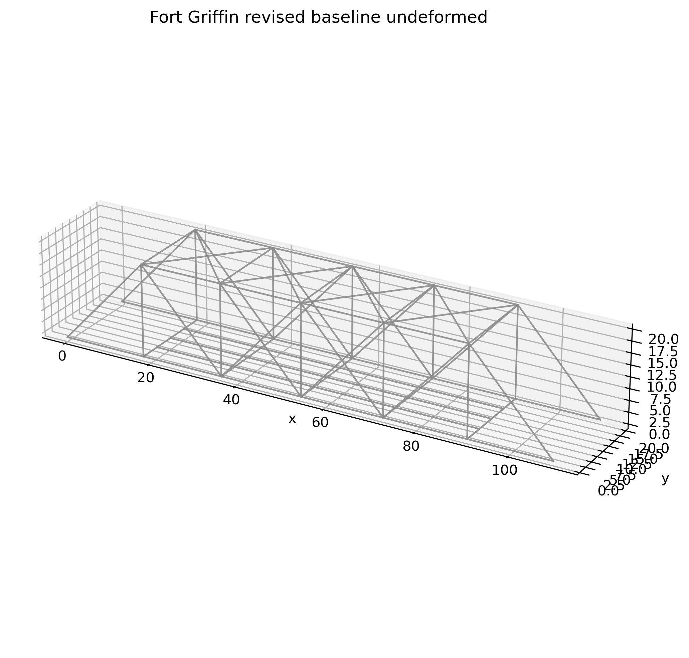

##### 4.6.3.2 Undeformed and Deformed Revised Baseline Model

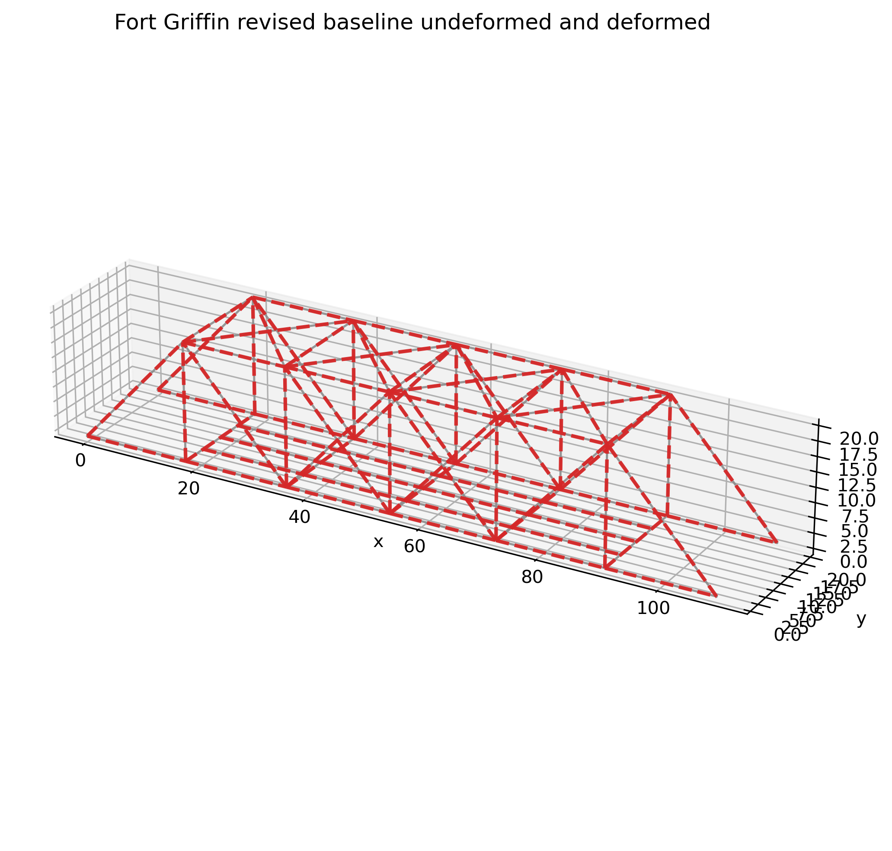

##### 4.6.3.3 Interactive Plotly Views

- [Undeformed interactive Plotly model](../outputs/final_bridge/plotly_plots/fort_griffin_revised_baseline_undeformed.html)
- [Undeformed and deformed interactive Plotly model](../outputs/final_bridge/plotly_plots/fort_griffin_revised_baseline_undeformed_plus_deformed.html)

#### 4.6.4  Baseline Run Notes

The  baseline run completed successfully and produced a stable structural response. The largest displacements occurred in the central region of the floor system, which is consistent with the location of the applied stringer loads and the expected transfer of gravity load from the floor system into the side trusses. The governing frame responses were concentrated in the central floor-beam region, which is also consistent with the expected bridge load path.

The  baseline model now includes two important refinements compared with the earlier bridge baseline. The first refinement is the  stringer layout and redistributed dead-load pattern. The second refinement is the addition of the top lateral bracing system. These changes give the bridge model a more realistic three dimensional load path than the earlier version.

#### 4.6.5 Current Baseline Limitations

The baseline is still a first-pass bridge model. The support assumptions remain simplified, the truss and frame properties are still partly assumed, the deck is not modeled explicitly, bottom lateral bracing has not yet been added, and explicit self-weight for all members has not yet been introduced separately.

#### 4.6.6 Planned Scenario Studies

The bridge study will compare the baseline against selected altered cases. The two main scenario studies chosen for the final report are

- missing diagonal
- weakened floor beam

A third case, weakened center stringer, may be used as a shorter sensitivity check if needed.
### 4.7 Baseline Setup with Added Dead Loads

#### 4.7.1 Baseline Loading

The baseline bridge model was upgraded from the earlier revised baseline so that gravity loading is represented more clearly in the analytical model. In this version, the floor system carries the primary distributed deck related load through the modeled stringer lines, and additional dead load is introduced to represent the weight of the structural members themselves. The purpose of this baseline is to establish a realistic gravity dominated reference state before the bridge is subjected to altered damage or sensitivity scenarios.

The loading idealization follows the simplified mixed bridge model used in this project.

- redistributed dead load is applied along the modeled stringer lines
- floor-beam self-weight is represented with uniform member loading on the floor beams
- truss self-weight is represented with fixed downward nodal loads at the truss joints

This approach is still a first-pass engineering idealization, but it is more complete than the earlier baseline that used only a limited deck-type load on selected stringer segments. It allows the model to represent gravity loading in both the frame dominated floor system and the truss dominated main span.

#### 4.7.2 Baseline Model File and Structural Idealization

The baseline discussed in this section corresponds to the Fort Griffin main-span input file that includes the updated dead-load package and the first-pass top lateral bracing system. The bridge is modeled as a mixed three dimensional system composed of

- two side truss planes
- transverse floor beams
- three longitudinal stringer lines
- top lateral bracing between the two side trusses

The side trusses and top lateral bracing are modeled with 3D truss elements. The floor beams and stringers are modeled with 3D frame elements. This mixed idealization is central to the final project because the bridge does not behave as a pure truss. The floor system receives and distributes gravity load through bending, while the side trusses provide the main span carrying action through axial force transfer.

In the revised floor-system idealization, the two outer stringer lines are assigned the heavier section and the center stringer line is assigned the lighter section. This gives the simplified three-stringer model a closer relationship to the real bridge floor system than the earlier baseline version.

#### 4.7.3 Baseline Figures

##### 4.7.3.1 Undeformed baseline model

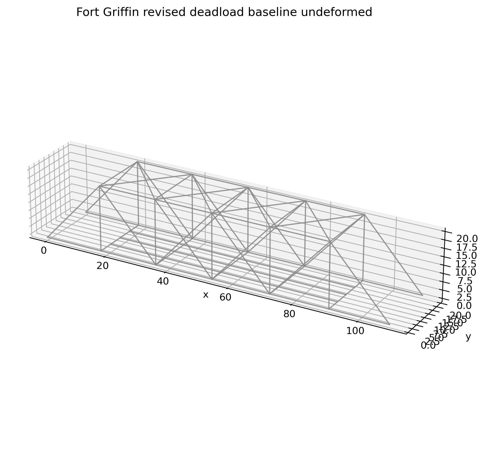

##### 4.7.3.2 Undeformed and deformed baseline model

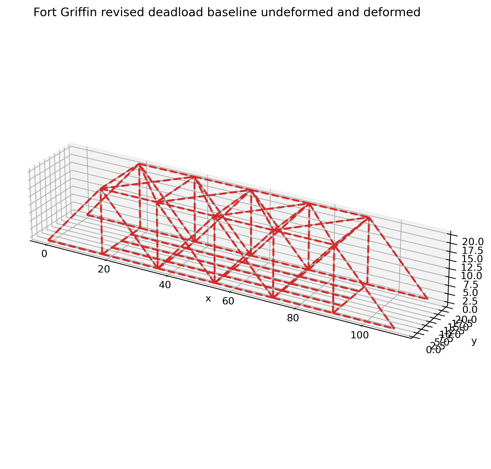

##### 4.7.3.3 Plotly undeformed view

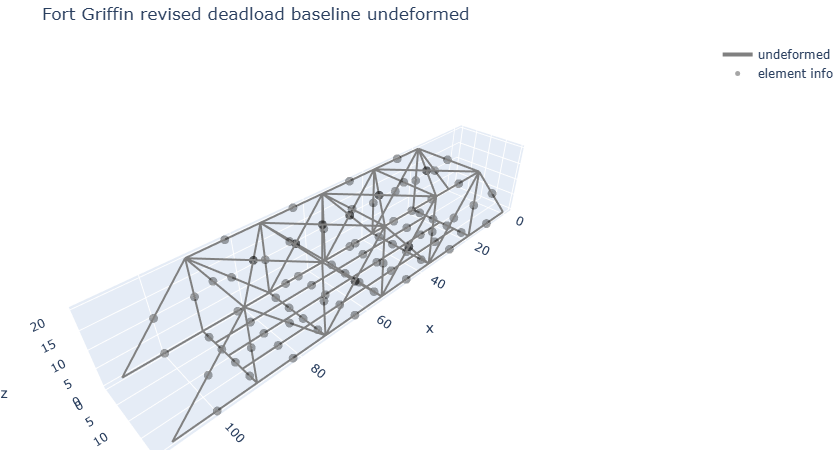

##### 4.7.3.4 Plotly undeformed and deformed view

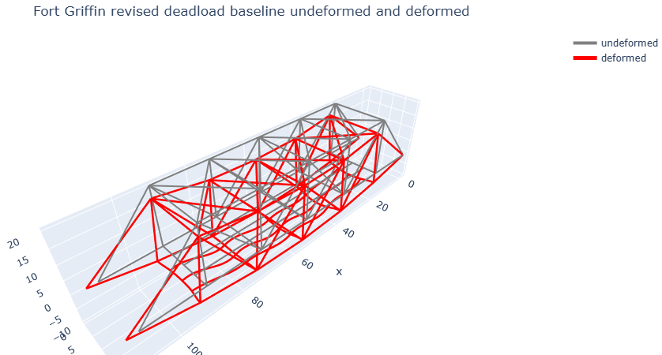

##### 4.7.3.5 Interactive Plotly files

- [Undeformed interactive Plotly model](../outputs/final_bridge/plotly_plots/fort_griffin_revised_deadload_undeformed.html)
- [Undeformed and deformed interactive Plotly model](../outputs/final_bridge/plotly_plots/fort_griffin_revised_deadload_undeformed_plus_deformed.html)

#### 4.7.4 Baseline Response and Deformed Shape

The dead-load baseline ran successfully and produced a stable response. The model contains 39 nodes and 91 elements, including both truss and frame members. The maximum displacement magnitude is approximately `0.000583 ft`, which is about `0.007 in`. For a bridge with a main span of about 109 ft, this is a very small absolute deformation under a gravity-type baseline load case and is not immediately suggestive of unrealistic softness or numerical instability.

The largest displacement occurs at node 32, near the middle region of the floor system. Nearby floor nodes such as 31, 33, 29, and 35 also show the next largest displacements. The lower chord joints of the side trusses in the same span region move downward as well, but the floor-system nodes show the larger local response. This pattern is physically reasonable. The deck-support system receives the load first, so the floor beams and stringers develop the largest local vertical sag before the load is redistributed into the side trusses.

The deformed-shape figure is especially useful here. Even with amplified plotting, the bridge remains geometrically coherent and does not show disconnected pieces, wild twisting, or unrealistic lateral sway. The red deformed geometry tracks the original structural layout clearly, with the most visible sag concentrated in the central floor-system region. The upper truss profile, lower truss profile, and top lateral bracing all remain connected and deform together as one structural system.

The vertical response clearly dominates the baseline deformation. The main movement is downward in the floor system, while transverse drift remains negligible in comparison. This is consistent with the type of load applied and also indicates that the first-pass top lateral bracing together with the current support assumptions are sufficient to prevent spurious lateral movement in the present gravity baseline.

#### 4.7.5 Interpretation of Mixed Truss and Frame Behavior

The baseline response shows why this bridge should not be modeled as a pure truss if the goal is to understand the actual load path. The floor beams and stringers behave as frame members, so they develop local bending response and control the short-range sag pattern at the deck level. The side trusses behave primarily as axial-force systems, so they control the larger span-level redistribution of load and provide the main resistance across the full bridge length.

This dual structural character is visible in the response pattern.

- the largest local displacements occur in the floor-system region
- the side trusses do not sag independently of the floor system
- the bridge responds as a connected mixed system rather than as two isolated trusses with a decorative deck

The deformed shape therefore supports the basic engineering interpretation that the floor system acts as the first load-receiving subsystem and the two side trusses act as the main span-carrying subsystem. This is one of the most important observations in the final bridge study because it justifies the use of a mixed truss and frame solver for the Fort Griffin bridge.

#### 4.7.6 Baseline Scale of Deformation and Support Response

The scale of the computed deformation remains small relative to the bridge size. Even the maximum displacement is only a small fraction of an inch. That result is appropriate for a baseline gravity case and supports the view that the bridge model is globally stiff enough to behave plausibly under service-type loading.

The end reactions also remain broadly balanced. The four lower support regions share the vertical reaction in a way that is consistent with a bridge carrying gravity load through both truss planes and the connected floor system. The reaction pattern is not perfectly uniform, but it is close enough to indicate that the model is behaving as a bridge-wide structural system rather than forcing the response into one side only.

#### 4.7.7 Engineering Meaning of the Baseline

The dead-load baseline gives a useful starting point for all later bridge scenarios. It establishes

- the basic gravity-load path
- the relative importance of the floor system in local deck-level deformation
- the role of the side trusses in span-level load redistribution
- the influence of the added top lateral bracing on three dimensional stability

Because the baseline now contains both redistributed deck-related dead load and explicit self-weight surrogates for the structural members, it is a stronger reference model than the earlier simplified baseline. It also gives a more defensible basis for later scenario comparisons, since any changes in displacement or force can be judged against a bridge state that already includes the main gravity effects.

#### 4.7.8 Current Baseline Limitations

The baseline is still a first-pass analytical model, not a full historical reconstruction. Several simplifications remain.

- support conditions are still partly idealized for stability
- member properties are still partly assumed
- the timber deck is represented through equivalent loading rather than explicit deck elements
- bottom lateral bracing is not yet included
- connection behavior is simplified

These limitations do not make the model unusable. They define the boundaries within which the baseline should be interpreted. The present baseline is best treated as a rational structural reference model for comparing scenario behavior, not as a final load-rating model of the historic bridge.

#### 4.7.9 Transition to Scenario Studies

With the added dead-load package and top lateral bracing now included, the baseline model is sufficiently developed to serve as the reference case for the scenario studies. The next stage of the bridge study will compare this baseline against selected altered cases, especially the missing diagonal scenario and the weakened floor-beam scenario, to examine how local damage or stiffness reduction changes the overall bridge response.
### 4.8 Extreme Missing-Diagonals Overload Scenario

#### 4.8.1 Scenario Purpose and Setup

This scenario was developed as an intentionally severe bridge response case rather than a mild damage case. The purpose was to create a clearly visible and mechanically meaningful change from the baseline so that the mixed truss and frame solver could be evaluated under a much more demanding structural condition.

The scenario starts from the revised dead-load baseline model and then changes only the bridge configuration and loading associated with the altered condition. The baseline assumptions regarding geometry, member types, material, support conditions, floor-system idealization, top lateral bracing, and dead-load representation are kept unchanged unless specifically modified in this scenario.

Two major changes were introduced.

1. Several important diagonal members near the central span region were removed from the side trusses. In the present model, elements `119`, `120`, `219`, and `220` were deleted.

2. A severe additional downward overload was applied in the central floor region. This overload was represented by concentrated nodal loads of `Fz = -2.0 kip` at nodes `31`, `32`, `33`, `34`, `35`, and `36`.

This scenario should therefore be interpreted as an extreme combined damage and overload condition. It is not intended to represent a normal operating state of the bridge. Its value in the project is that it reveals how the bridge load path changes when several important truss members are inactive and the floor system is forced to carry much larger local demand.

#### 4.8.2 Scenario Figures

##### 4.8.2.1 Undeformed extreme scenario model

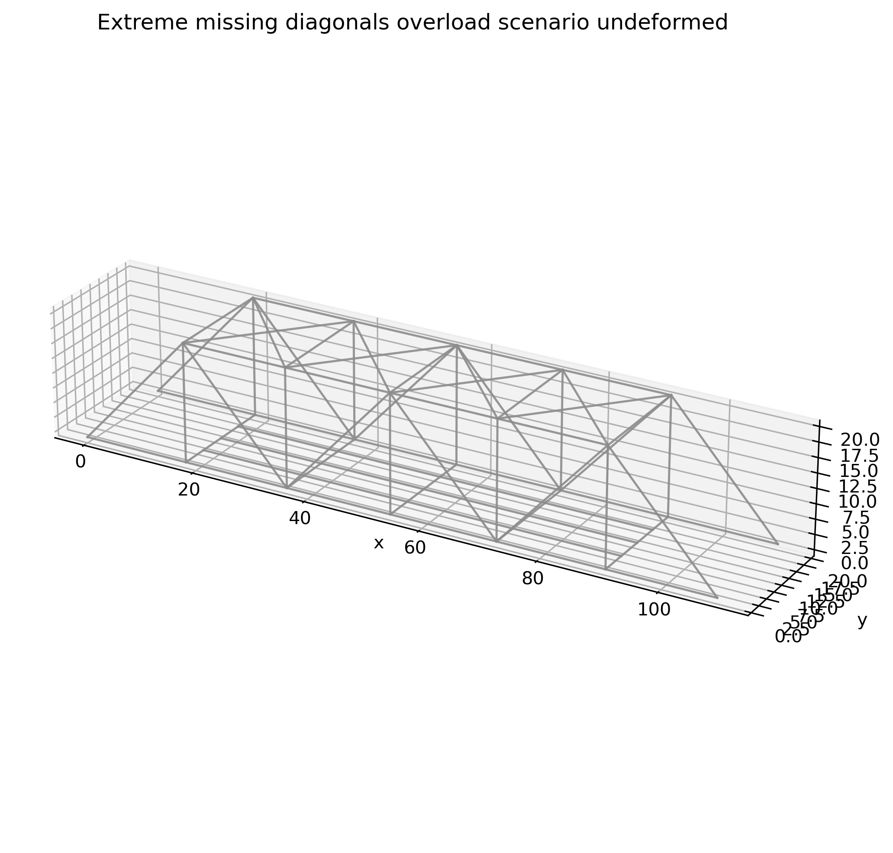

##### 4.8.2.2 Undeformed and deformed extreme scenario model

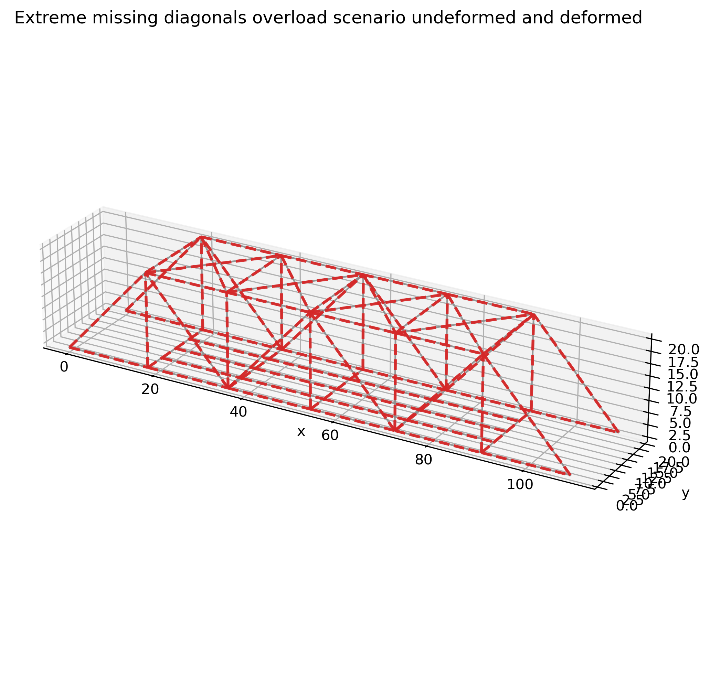

##### 4.8.2.3 Plotly undeformed view

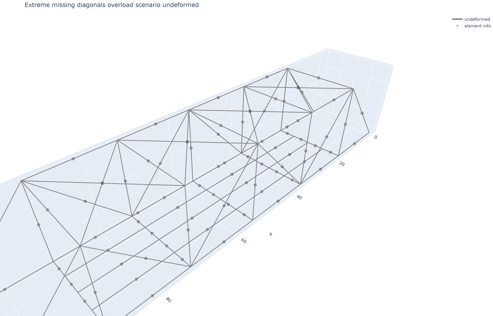

##### 4.8.2.4 Plotly undeformed and deformed view

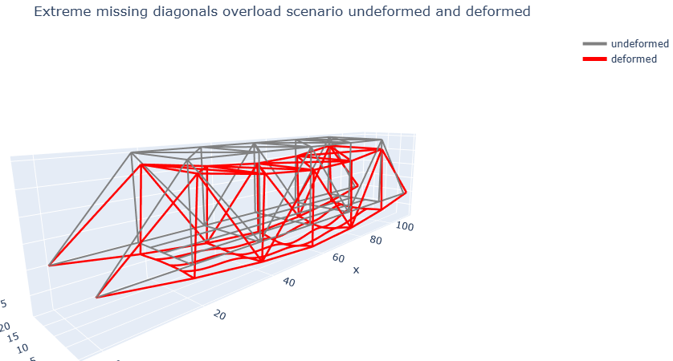

*Figure. Extreme missing diagonals overload case, undeformed and deformed view.*

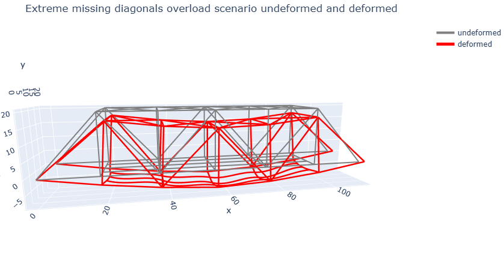

*Figure. Extreme missing diagonals overload case, showing relative displacement.*

##### 4.8.2.5 Interactive Plotly files

- [Undeformed interactive Plotly model](../outputs/final_bridge/plotly_plots/scenario_extreme_missing_diagonals_overload_undeformed.html)
- [Undeformed and deformed interactive Plotly model](../outputs/final_bridge/plotly_plots/scenario_extreme_missing_diagonals_overload_undeformed_plus_deformed.html)

#### 4.8.3 Visual Interpretation of the Deformed Shape

The deformed shape shows a much stronger response than the baseline. The greatest sag is concentrated in the central floor-system region, and the lower chord lines in both truss planes are pulled downward more strongly than in the baseline. The bridge still behaves as a connected structure, but the deformation pattern is much more pronounced and no longer resembles the mild service-type sag of the baseline case.

The figure makes the mixed structural behavior very clear. The floor system still acts as the first load receiving subsystem, but the local sag becomes much larger and spreads more strongly into the side trusses. At the same time, the removed diagonals reduce the ability of the side trusses to follow the original force path. The result is a bridge response that is still stable in the numerical model but much more strained and visibly distorted.


#### 4.8.4 Comparison with the Revised Dead-Load Baseline

The most important comparison values are summarized below.

| Response quantity | Revised dead-load baseline | Extreme scenario | Change |
|---|---:|---:|---:|
| Maximum displacement magnitude | 0.000583 ft | 0.000969 ft | +66.3% |
| Node of maximum displacement | 32 | 32 | same location |
| Total vertical reaction at nodes 1, 7, 13, 19 | 29.16 kip | 41.16 kip | +41.2% |
| Peak truss axial force | 10.54 kip | 17.32 kip | +64.3% |
| Peak frame end moment | 5.08 kip-ft | 13.39 kip-ft | +163.7% |

The maximum displacement remains at node `32`, which is still in the central floor-system region, but its magnitude increases sharply from about `0.000583 ft` to `0.000969 ft`. This is about a `66.3%` increase. The neighboring floor nodes also show very large increases. Node `31` rises from about `0.000544 ft` to `0.000888 ft`, about `63.2%`, and node `33` rises from about `0.000546 ft` to `0.000890 ft`, about `63.1%`.

The nearby lower chord joints also experience substantial growth in displacement. Node `4` increases from about `0.000488 ft` to `0.000778 ft`, about `59.5%`, and node `16` increases from about `0.000490 ft` to `0.000780 ft`, about `59.2%`. This shows that the floor-system overload is not remaining only in the stringers and floor beams. It is being transmitted into the main truss system in a much stronger way than in the baseline.

#### 4.8.5 Support-Reaction Changes

The vertical reactions at the four principal lower support points all increase significantly.

| Node | Baseline `Rz` kip | Extreme scenario `Rz` kip | Change |
|---|---:|---:|---:|
| 1 | 6.905 | 9.405 | +36.2% |
| 7 | 7.617 | 11.117 | +46.0% |
| 13 | 6.972 | 9.472 | +35.9% |
| 19 | 7.661 | 11.160 | +45.7% |

The support pattern remains broadly balanced between the two sides of the bridge, but the absolute reaction levels increase substantially. This indicates that the bridge is still redistributing load across the full span rather than collapsing into a one-sided mechanism, even under this severe case.

#### 4.8.6 Truss and Frame Demand Changes

The truss-force pattern changes strongly in this scenario. In the revised dead-load baseline, the largest truss axial-force demand was about `10.54 kip`. In the extreme scenario, the largest truss axial-force demand rises to about `17.32 kip`, which is about a `64.3%` increase.

The most critical truss members also shift toward the central lower chord and upper-end regions. In the extreme scenario, the largest truss axial-force magnitudes occur in members such as `203`, `204`, `103`, and `104`, which reach values around `17.25 kip` to `17.32 kip`. In the baseline, the largest values were only around `10.37 kip` to `10.54 kip`. This is a strong indication of major force-path redistribution in the truss system.

The frame demand increases even more dramatically. In the revised dead-load baseline, the largest frame end moment was about `5.08 kip-ft`. In the extreme scenario, the largest frame end moment rises to about `13.39 kip-ft`, which is about a `163.7%` increase. The most critical frame members shift into the overloaded central floor-beam region, especially elements `305`, `308`, `306`, and `307`. This is fully consistent with the scenario definition, since the additional overload was applied directly in that floor-system region.

#### 4.8.7 Engineering Interpretation

This scenario produces a much stronger response than the baseline because it combines two different ways of degrading the bridge behavior at the same time. Removing the diagonals weakens the original truss load path, while the added central overload forces the floor system and the remaining truss members to carry much more demand.

The results show that the bridge response is no longer controlled only by mild gravity sag in the floor system. The missing diagonals cause the truss system to lose part of its preferred axial-force path, and the overload then pushes larger deformation and force demand into the surrounding members. The frame subsystem becomes much more highly stressed, and the truss subsystem also shows a major increase in axial-force demand.

This case therefore demonstrates one of the main goals of the final project. The mixed solver is not just producing output tables. It is showing how the structural behavior changes when the bridge is forced into a drastically altered state. The results make clear that severe local damage combined with severe overload can amplify both local frame response and global truss response at the same time.


#### 4.8.9 Scenario Limits

This scenario should be interpreted as an intentionally severe sensitivity study rather than a calibrated historical damage case. The removed diagonals and added overload were selected to create a drastic but still solvable response so that the mixed bridge model could be pushed into a clearly altered structural state. The scenario is therefore valuable for understanding structural sensitivity and load-path redistribution, but it should not be mistaken for a literal prediction of how the real bridge would fail under field conditions.

### 4.9 Weakened Floor Beam Scenario

#### 4.9.1 Scenario Purpose and Setup

This scenario investigates a local floor-system weakness case rather than a global truss-damage case. The purpose is to examine how the bridge response changes when one important transverse floor-beam line loses stiffness while the rest of the bridge remains intact.

The scenario starts from the revised dead-load baseline model. The baseline assumptions regarding geometry, supports, truss layout, top lateral bracing, stringer layout, and dead-load representation are kept unchanged. Only one local change is introduced.

The central floor-beam line was weakened by assigning a reduced-stiffness section to elements `309`, `310`, `311`, and `312`. These members form the floor-beam line through nodes `4-31-32-33-16`, which lies in the central region of the bridge where the baseline gravity response is already most active.

This scenario is intended to represent deterioration, section loss, or serious stiffness reduction in one transverse floor-beam assembly. Unlike the extreme missing-diagonals overload scenario, this case isolates local floor-system weakening without introducing extra overload or removing major truss members.

#### 4.9.2 Scenario Figures

##### 4.9.2.1 Undeformed weakened floor-beam model

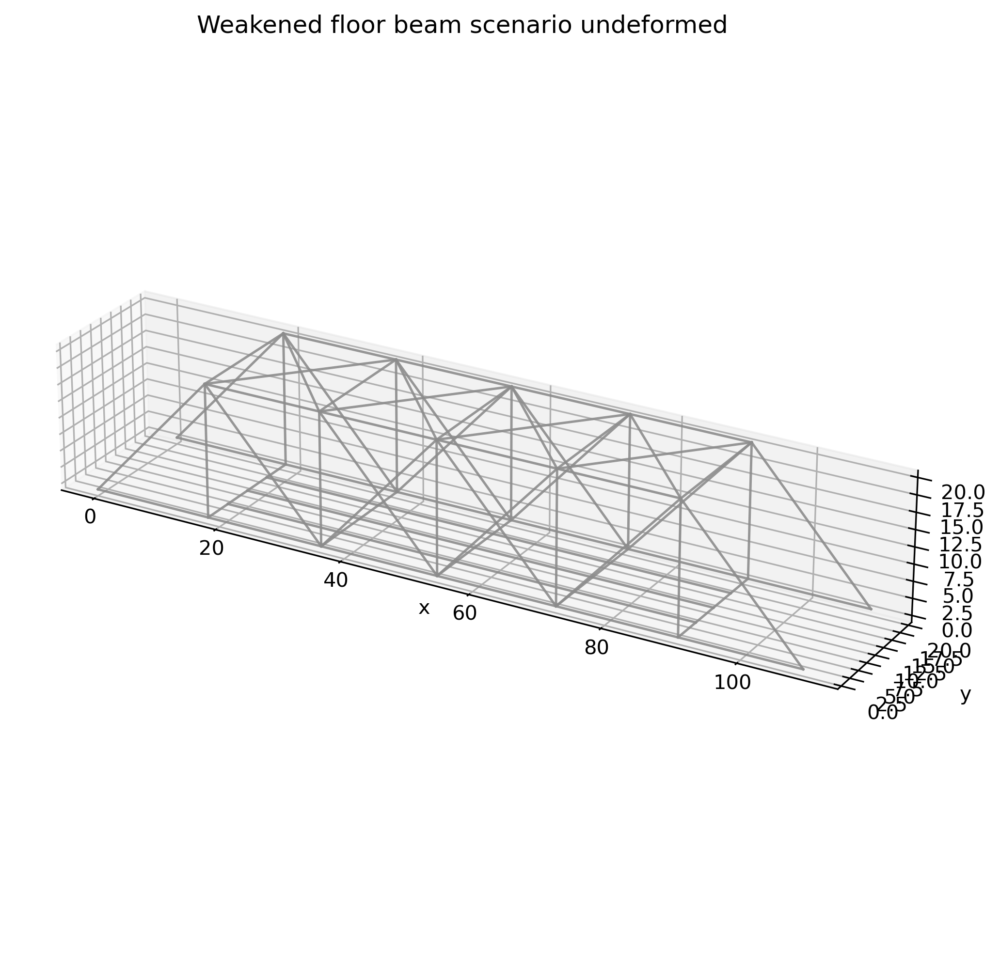

##### 4.9.2.2 Undeformed and deformed weakened floor-beam model

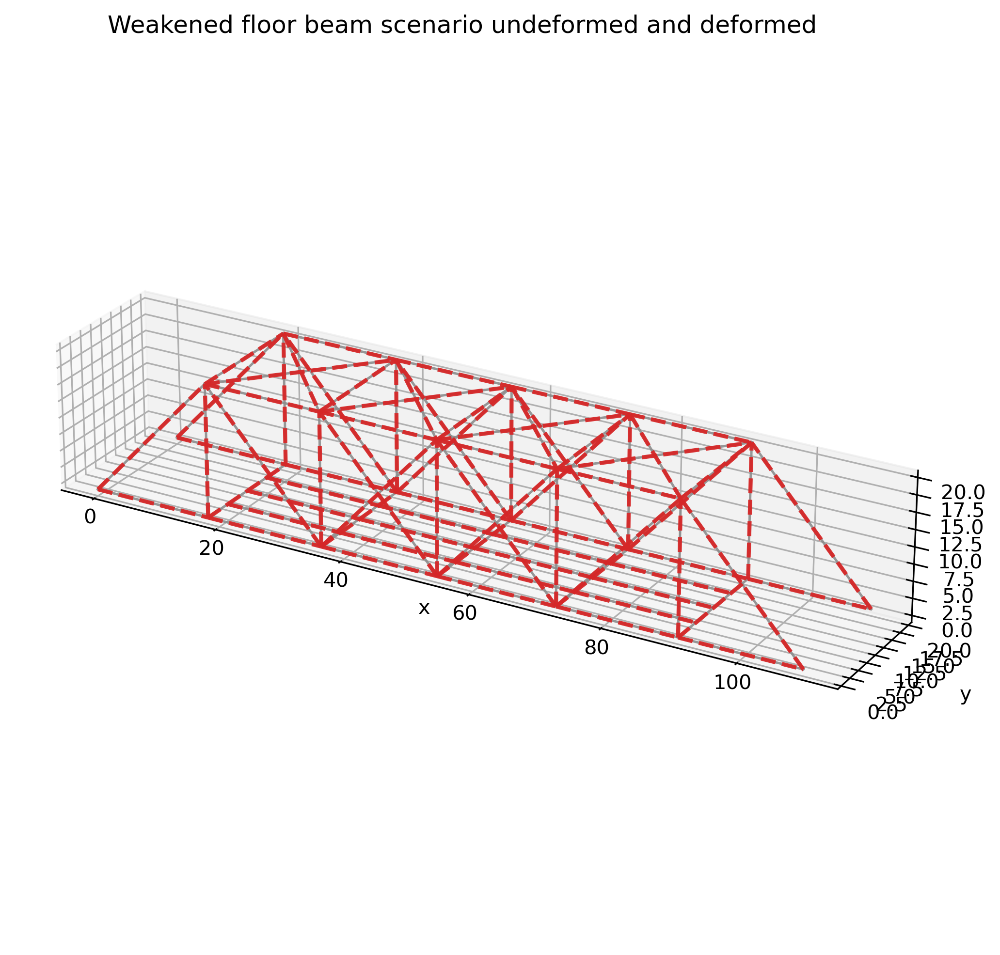

##### 4.9.2.3 Plotly undeformed view

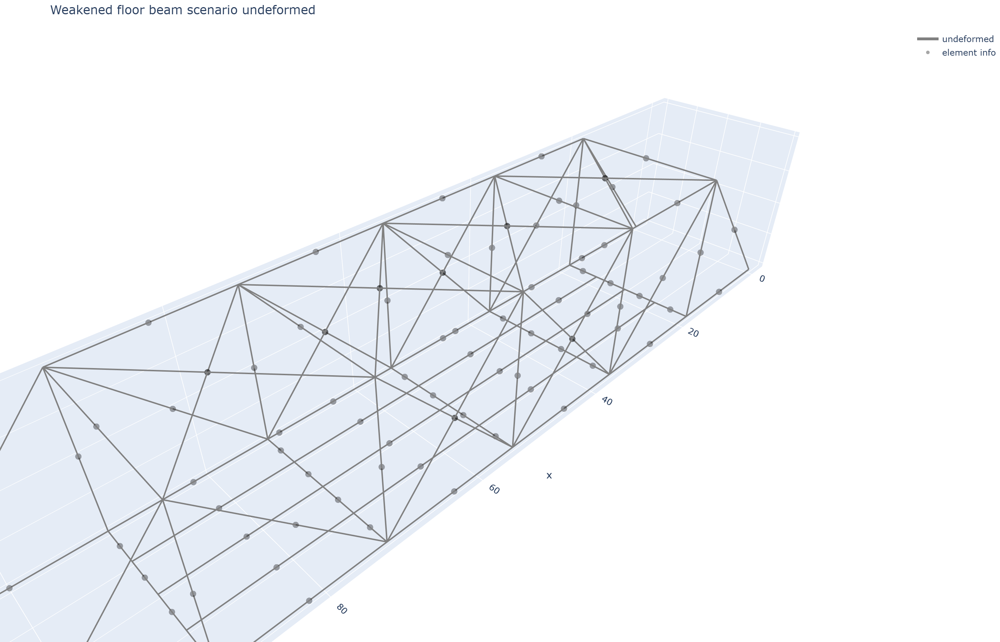

##### 4.9.2.4 Plotly undeformed and deformed view

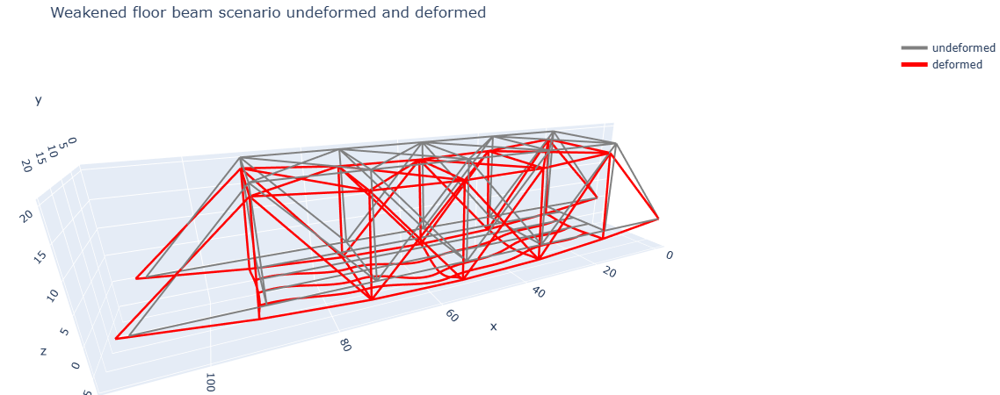

##### 4.9.2.5 Interactive Plotly files

- [Undeformed interactive Plotly model](../outputs/final_bridge/plotly_plots/scenario_weakened_floor_beam_from_deadload_undeformed.html)
- [Undeformed and deformed interactive Plotly model](../outputs/final_bridge/plotly_plots/scenario_weakened_floor_beam_from_deadload_undeformed_plus_deformed.html)

#### 4.9.3 Visual Interpretation of the Deformed Shape

The weakened-floor-beam response is clearly different in character from the extreme missing-diagonals overload case. The bridge remains globally coherent, and the deformation is still dominated by vertical sag rather than broad bridge-wide distortion. The largest visible change is concentrated in the central floor-system region, especially along the weakened transverse beam line and the nearby stringer nodes.

This result shows a local damage mechanism rather than a global load-path breakdown. The side trusses still provide the main span-carrying action, but the floor system near the weakened beam becomes more flexible and shows larger local downward movement. The deformed-shape figure therefore supports the interpretation that weakening the transverse framing changes local deck-level behavior more strongly than overall global bridge form.

The figures also continue to show the dual structural character of the bridge. The frame subsystem controls the local deformation pattern at the loaded deck level, while the truss subsystem controls the broader span-level restraint and redistribution. In this scenario, the weakened beam line becomes the most visually important local feature, but the bridge still responds as a connected mixed truss-frame system.

#### 4.9.4 Comparison with the Revised Dead-Load Baseline

The main comparison for this scenario is local vertical displacement in the floor system.

| Quantity | Baseline | Weakened floor beam | Change |
|---|---:|---:|---:|
| Node 32 vertical displacement | `9.0928 × 10^-5 ft` | `1.1114 × 10^-4 ft` | `+22.2%` |
| Node 29 vertical displacement | `8.6486 × 10^-5 ft` | `8.6989 × 10^-5 ft` | `+0.6%` |
| Node 35 vertical displacement | `8.6486 × 10^-5 ft` | `8.6989 × 10^-5 ft` | `+0.6%` |
| Node 4 vertical displacement | `6.9303 × 10^-5 ft` | `6.9267 × 10^-5 ft` | about `0%` |

The maximum vertical displacement remains at node `32`, but its magnitude increases substantially. This is the clearest numerical sign that the weakened floor beam is affecting the local floor-system response.

The neighboring stringer-line nodes `29` and `35` change only slightly, and the nearby truss node `4` remains almost unchanged. This pattern is important because it shows that the dominant effect is local floor-system flexibility rather than a major loss of global truss stiffness.

#### 4.9.5 Engineering Interpretation

This scenario is the strongest local damage-style case in the bridge study. The results show that reducing the stiffness of one important floor-beam line does not cause a global structural breakdown, but it does create a clear increase in local deck-level deformation.

That is physically reasonable. Gravity load enters the floor system first, so weakening a transverse floor beam should affect the local displacement field and transverse load sharing more directly than it affects the overall truss geometry. The side trusses still provide the main span-level resistance, which is why the bridge remains globally stable and the nearby truss-joint displacement changes remain modest.

This scenario therefore reveals an important aspect of the bridge behavior. Under the present loading assumptions, the floor system is more sensitive to local stiffness loss than the main side trusses are. In practical terms, that means floor-system deterioration can produce noticeable serviceability effects even when the bridge as a whole still appears globally stable.

#### 4.9.6 Comparison with the Extreme Missing-Diagonals Scenario

The weakened-floor-beam case and the extreme missing-diagonals overload case are useful together because they show two different structural response modes.

- The extreme missing-diagonals overload case produces a much larger and more global bridge distortion.
- The weakened-floor-beam case produces a clearer local floor-system response with much less global disturbance.


#### 4.9.7 Why This Scenario Matters for the Project

This scenario addresses one of the main goals of the final project, which is not only to run a complex bridge model but also to interpret how the response changes when a meaningful assumption is altered. The weakened-floor-beam case shows that the bridge is not equally sensitive to all changes. A local loss of floor-beam stiffness creates a strong local displacement response without causing the much larger global change seen in the extreme truss-damage case.

This is exactly the kind of engineering interpretation the project outline calls for. The results go beyond simply reporting output tables. They show where the structure is most sensitive, what kind of subsystem is controlling the response, and how the nature of the structural change affects the bridge behavior.


## References

Historic American Engineering Record. (1996). *Fort Griffin Iron Truss Bridge* (HAER No. TX-63). Report prepared as part of the Texas Historic Bridge Recording Project sponsored by the Texas Department of Transportation.

Maniar, D. R., Engelhardt, M. D., & Leary, D. E. (2003, March 1). *Evaluation and rehabilitation of historic metal truss bridges. A case study of an off-system historic metal truss bridge in Shackelford County, Texas* (FHWA/TX-03/1741-3). Center for Transportation Research, The University of Texas at Austin. [https://rosap.ntl.bts.gov/view/dot/86168](https://rosap.ntl.bts.gov/view/dot/86168)

## Hand_verification file:

[Handdrawn solution 1 PDF](report/Hand%20verification/Frame%20baseline.pdf)\
[Handdrawn solution 2 PDF](report/Hand%20verification/Frame%20Special.pdf)
